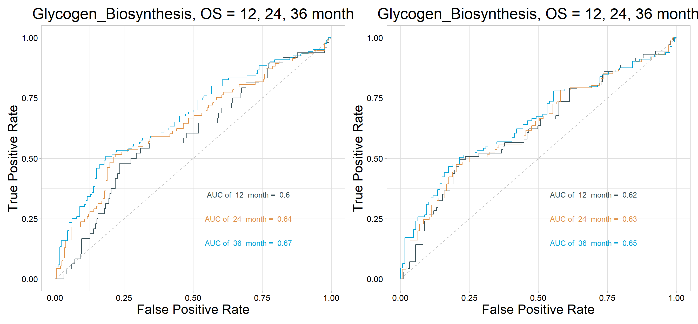

# **Signature Score and Relevant phenotypes**

## Loading packages
Load the IOBR package in your R session after the installation is complete:

``` r
library(IOBR)
library(survminer)
library(tidyverse)
```

## Downloading data for example
Obtaining data set from GEO [Gastric cancer: GSE62254](https://pubmed.ncbi.nlm.nih.gov/25894828/) using `GEOquery` R package.

``` r
if (!requireNamespace("GEOquery", quietly = TRUE))  BiocManager::install("GEOquery")
library("GEOquery")
# NOTE: This process may take a few minutes which depends on the internet connection speed. Please wait for its completion.
eset_geo <- getGEO(GEO = "GSE62254", getGPL  = F, destdir = "./")
eset    <- eset_geo[[1]]
eset    <- exprs(eset)
eset[1:5,1:5]
```

```
##           GSM1523727 GSM1523728 GSM1523729 GSM1523744 GSM1523745
## 1007_s_at  3.2176645  3.0624323  3.0279131   2.921683  2.8456013
## 1053_at    2.4050109  2.4394879  2.2442708   2.345916  2.4328582
## 117_at     1.4933412  1.8067380  1.5959665   1.839822  1.8326058
## 121_at     2.1965561  2.2812181  2.1865556   2.258599  2.1874363
## 1255_g_at  0.8698382  0.9502466  0.8125414   1.012860  0.9441993
```

## Gene Annotation
Annotation of genes in the expression matrix and removal of duplicate genes.

``` r
# Load the annotation file `anno_hug133plus2` in IOBR.
head(anno_hug133plus2)
```

```
## # A tibble: 6 × 2
##   probe_id  symbol 
##   <fct>     <fct>  
## 1 1007_s_at MIR4640
## 2 1053_at   RFC2   
## 3 117_at    HSPA6  
## 4 121_at    PAX8   
## 5 1255_g_at GUCA1A 
## 6 1294_at   MIR5193
```

``` r
# Conduct gene annotation using `anno_hug133plus2` file; If identical gene symbols exists, these genes would be ordered by the mean expression levels. The gene symbol with highest mean expression level is selected and remove others. 

eset<-anno_eset(eset       = eset,
                annotation = anno_hug133plus2,
                symbol     = "symbol",
                probe      = "probe_id",
                method     = "mean")
eset[1:5, 1:3]
```

```
##              GSM1523727 GSM1523728 GSM1523729
## SH3KBP1        4.327974   4.316195   4.351425
## RPL41          4.246149   4.246808   4.257940
## EEF1A1         4.293762   4.291038   4.262199
## COX2           4.250288   4.283714   4.270508
## LOC101928826   4.219303   4.219670   4.213252
```


## Estimation of signatures

``` r
sig_tme<-calculate_sig_score(pdata           = NULL,
                             eset            = eset,
                             signature       = signature_collection,
                             method          = "pca",
                             mini_gene_count = 2)

sig_tme <- t(column_to_rownames(sig_tme, var = "ID"))
sig_tme[1:5, 1:3]
```

```
##                   GSM1523727 GSM1523728 GSM1523729
## CD_8_T_effector   -2.5513794  0.7789141 -2.1770675
## DDR               -0.8747614  0.7425162 -1.3272054
## APM                1.1098368  2.1988688 -0.9516419
## Immune_Checkpoint -2.3701787  0.9455120 -1.4844104
## CellCycle_Reg      0.1063358  0.7583302 -0.3649795
```

## Combining score data and phenotype data


``` r
data("pdata_acrg", package = "IOBR")
head(pdata_acrg)
```

```
##            ID ProjectID  Technology       platform Gender Age RFS_time
## 71 GSM1523727  GSE62254 Affymetrix  HG-U133_Plus_2      M  67     3.97
## 72 GSM1523728  GSE62254 Affymetrix  HG-U133_Plus_2      F  68     4.03
## 73 GSM1523729  GSE62254 Affymetrix  HG-U133_Plus_2      F  42    74.97
## 74 GSM1523744  GSE62254 Affymetrix  HG-U133_Plus_2      M  69    89.77
## 75 GSM1523745  GSE62254 Affymetrix  HG-U133_Plus_2      M  68    84.60
## 76 GSM1523746  GSE62254 Affymetrix  HG-U133_Plus_2      M  56     5.77
##    RFS_status OS_time OS_status     Lauren Differtiation AJCC_Stage_confuse
## 71         NA   88.73         0 Intestinal            MD                  2
## 72         NA   88.23         0 Intestinal            PD                  2
## 73          0   88.23         0    Diffuse            PD                  2
## 74          0  105.70         0    Diffuse            PD                  2
## 75          0  105.53         0    Diffuse            PD                  3
## 76          1   25.50         1      Mixed            PD                  2
##    T_stage N_stage M_stage Lymph_node_examined Positive_lymph_nodes
## 71       2       1       0                  20                    3
## 72       2       1       0                  40                    1
## 73       2       1       0                  21                    1
## 74       2       1       0                  24                    3
## 75       3       2       0                  52                   11
## 76       2       1       0                  22                    5
##    Revisedlocation MSI EBV Hpylori   Subtype TP53mutated B.cells.naive
## 71            Body   1   0      NA       MSI           0   0.006611704
## 72            Body   1  NA      NA       MSI           0   0.000000000
## 73          Antrum   0   0       0 MSS/TP53+           1   0.003306927
## 74          Antrum   1   0       1       MSI           0   0.000000000
## 75          Antrum   0   0      NA MSS/TP53-           0   0.000000000
## 76          Antrum   0   0       0 MSS/TP53-           0   0.013619480
##    B.cells.memory Plasma.cells T.cells.CD8 T.cells.CD4.naive
## 71    0.014570868   0.17555729  0.05712737                 0
## 72    0.036202099   0.08523233  0.05336971                 0
## 73    0.020935673   0.10489546  0.00000000                 0
## 74    0.072648177   0.08755997  0.03465107                 0
## 75    0.009798381   0.12251030  0.00000000                 0
## 76    0.012784581   0.15602714  0.00000000                 0
##    T.cells.CD4.memory.resting T.cells.CD4.memory.activated
## 71                  0.1439895                  0.025159835
## 72                  0.1250515                  0.049617381
## 73                  0.1849220                  0.008407981
## 74                  0.1396439                  0.055268600
## 75                  0.1916398                  0.036578672
## 76                  0.1905921                  0.008992440
##    T.cells.follicular.helper T.cells.regulatory..Tregs. T.cells.gamma.delta
## 71                0.02453957                          0          0.00000000
## 72                0.05318251                          0          0.00000000
## 73                0.05098080                          0          0.03714459
## 74                0.07825130                          0          0.00000000
## 75                0.02223859                          0          0.02657259
## 76                0.04740728                          0          0.04283296
##    NK.cells.resting NK.cells.activated Monocytes Macrophages.M0 Macrophages.M1
## 71      0.000000000        0.049325657         0     0.03865693     0.06910287
## 72      0.000000000        0.081481924         0     0.07370723     0.08016443
## 73      0.000000000        0.025252673         0     0.00000000     0.06161940
## 74      0.000000000        0.016121853         0     0.08866391     0.08173804
## 75      0.001738259        0.006267907         0     0.15255902     0.07161270
## 76      0.000000000        0.052117471         0     0.10298038     0.03246627
##    Macrophages.M2 Dendritic.cells.resting Dendritic.cells.activated
## 71      0.1829208               0.0000000               0.022904531
## 72      0.1320919               0.0000000               0.060491149
## 73      0.1170839               0.1171129               0.032385282
## 74      0.1441202               0.0000000               0.060937005
## 75      0.1919279               0.0000000               0.006087801
## 76      0.1093805               0.0000000               0.023914527
##    Mast.cells.resting Mast.cells.activated Eosinophils Neutrophils.x P.value
## 71        0.069286038          0.000000000 0.006315889    0.11393115       0
## 72        0.003322764          0.005197745 0.056141443    0.10474585       0
## 73        0.052571970          0.000000000 0.104493538    0.07888690       0
## 74        0.012494201          0.006833953 0.050435095    0.07063272       0
## 75        0.000000000          0.033928747 0.017164438    0.10937487       0
## 76        0.014373257          0.002764802 0.115772442    0.07397439       0
##    Pearson.Correlation      RMSE    T.cells CD8.T.cells Cytotoxic.lymphocytes
## 71           0.3359926 0.9415173 -0.9275804   0.8492914            -1.1005262
## 72           0.4793134 0.8827802 -0.5306279  -0.2017907             0.1858499
## 73           0.3638005 0.9308186 -0.9566316   0.2411951            -0.8800338
## 74           0.3569989 0.9332100 -1.0464552  -0.5771205            -0.5619472
## 75           0.4226987 0.9062522 -0.6796120   0.6670229            -0.3361456
## 76           0.4113346 0.9112588 -0.6978480  -1.1110102            -0.7631710
##        NK.cells   B.lineage Monocytic.lineage Myeloid.dendritic.cells
## 71 -0.083623737 -0.54974243       -1.40389061              -0.7589211
## 72  0.156167025 -0.33750363       -0.03696397              -0.6393975
## 73  0.003538847  0.01597566       -0.67105808               0.7452174
## 74 -0.010774923 -0.56740438        0.06877240              -0.2511140
## 75 -0.028429092 -0.73180429        0.21574792              -0.1165082
## 76  0.466964699  0.15583392       -0.97524359              -0.7448360
##    Neutrophils.y Endothelial.cells Fibroblasts StromalScore ImmuneScore
## 71    -0.9527759       -1.42753593 -1.22754105   -1.8047694  -1.3347047
## 72     0.5640500       -0.17320689  0.41586717    0.1825225   0.1950604
## 73    -0.3415288       -0.25784297  0.04110246   -0.1863425  -0.4960305
## 74    -1.2984378       -1.05394707  0.00743277   -0.2731398  -0.7950682
## 75     0.4227674        0.03025664  0.32245183    0.3165798  -0.2416774
## 76    -0.4411653       -0.29582293 -0.68833740   -0.9119449  -0.8475150
##    ESTIMATEScore TumorPurity ProjectID2   TMEscoreA    TMEscoreB    TMEscore
## 71   -1.70632719   1.1687573   GSE62254 -1.06110812 -1.270222413  0.60585688
## 72    0.20292720          NA   GSE62254  1.14698153 -0.333585646  0.73717229
## 73   -0.35721073  -1.3859061   GSE62254 -0.89026369 -0.007906066 -0.35452887
## 74   -0.55795758  -0.9855180   GSE62254 -0.01116022 -0.984841623  0.79880007
## 75    0.05885805          NA   GSE62254 -0.27102383 -0.017592784 -0.09554256
## 76   -0.94967710  -0.2162267   GSE62254 -0.94526260  0.161818627 -0.51527214
##    TMEscore_binary
## 71             Low
## 72            High
## 73             Low
## 74            High
## 75             Low
## 76             Low
```

``` r
input <- combine_pd_eset(eset = sig_tme, pdata = pdata_acrg, scale = T)
```


## Identifying features associated with survival


``` r
res<- batch_surv(pdata    = input,
                 time     = "OS_time", 
                 status   = "OS_status", 
                 variable = colnames(input)[69:ncol(input)])
head(res)
```

```
## # A tibble: 6 × 5
##   ID                           P    HR CI_low_0.95 CI_up_0.95
##   <chr>                    <dbl> <dbl>       <dbl>      <dbl>
## 1 Folate_biosynthesis   1.00e-10 0.579       0.490      0.683
## 2 TMEscore_CIR          1.32e- 9 0.640       0.554      0.739
## 3 Glycogen_Biosynthesis 3.24e- 9 1.52        1.32       1.74 
## 4 Pan_F_TBRs            6.33e- 9 1.55        1.34       1.80 
## 5 TMEscoreB_CIR         7.17e- 9 1.52        1.32       1.75 
## 6 TMEscore_plus         8.08e- 9 0.638       0.547      0.743
```

Use forest plots `sig_forest` to show the most relevant variables to overall survival

``` r
res<- res[nchar(res$ID)<=28, ]
p1<- sig_forest(res, signature = "ID", n = 20)
```

## Visulization using heatmap

Relationship between Signatures and molecular typing.
Heatmap visualisation using `IOBR`'s `sig_heatmap`

``` r
p2 <- sig_heatmap(input         = input, 
                  features      = res$ID[1:20],
                  group         = "Subtype", 
                  palette_group = "jama", 
                  palette       = 6,
                  path          = "result" )
```


## Focus on target signatures

``` r
p1 <- sig_box(data           = input, 
              signature      = "Glycogen_Biosynthesis",
              variable       = "Subtype",
              jitter         = FALSE,
              cols           =  NULL,
              palette        = "jama",
              show_pvalue    = TRUE,
              size_of_pvalue = 5,
              hjust          = 1, 
              angle_x_text   = 60, 
              size_of_font   = 8)
```

```
## # A tibble: 6 × 8
##   .y.       group1    group2           p    p.adj p.format p.signif method  
##   <chr>     <chr>     <chr>        <dbl>    <dbl> <chr>    <chr>    <chr>   
## 1 signature EMT       MSI       5.39e-15 3.20e-14 5.4e-15  ****     Wilcoxon
## 2 signature EMT       MSS/TP53- 5.53e-13 2.8 e-12 5.5e-13  ****     Wilcoxon
## 3 signature EMT       MSS/TP53+ 1.90e-12 7.6 e-12 1.9e-12  ****     Wilcoxon
## 4 signature MSI       MSS/TP53- 1.14e- 3 3.4 e- 3 0.0011   **       Wilcoxon
## 5 signature MSI       MSS/TP53+ 7.05e- 3 1.4 e- 2 0.0071   **       Wilcoxon
## 6 signature MSS/TP53- MSS/TP53+ 7.16e- 1 7.2 e- 1 0.7161   ns       Wilcoxon
```

``` r
p2 <- sig_box(data           = input, 
              signature      = "Pan_F_TBRs",
              variable       = "Subtype",
              jitter         = FALSE,
              cols           = NULL,
              palette        = "jama",
              show_pvalue    = TRUE,
              angle_x_text   = 60, 
              hjust          = 1, 
              size_of_pvalue = 5, 
              size_of_font   = 8)
```

```
## # A tibble: 6 × 8
##   .y.       group1    group2           p    p.adj p.format p.signif method  
##   <chr>     <chr>     <chr>        <dbl>    <dbl> <chr>    <chr>    <chr>   
## 1 signature EMT       MSI       7.98e-17 3.20e-16 <2e-16   ****     Wilcoxon
## 2 signature EMT       MSS/TP53- 1.70e-17 1   e-16 <2e-16   ****     Wilcoxon
## 3 signature EMT       MSS/TP53+ 2.57e-17 1.3 e-16 <2e-16   ****     Wilcoxon
## 4 signature MSI       MSS/TP53- 1.32e- 2 4   e- 2 0.013    *        Wilcoxon
## 5 signature MSI       MSS/TP53+ 6.99e- 2 1.4 e- 1 0.070    ns       Wilcoxon
## 6 signature MSS/TP53- MSS/TP53+ 4.02e- 1 4   e- 1 0.402    ns       Wilcoxon
```

``` r
p3 <- sig_box(data           = input, 
              signature      = "Immune_Checkpoint",
              variable       = "Subtype",
              jitter         = FALSE,
              cols           = NULL,
              palette        = "jama",
              show_pvalue    = TRUE,
              angle_x_text   = 60, 
              hjust          = 1, 
              size_of_pvalue = 5, 
              size_of_font   = 8)
```

```
## # A tibble: 6 × 8
##   .y.       group1    group2           p        p.adj p.format p.signif method  
##   <chr>     <chr>     <chr>        <dbl>        <dbl> <chr>    <chr>    <chr>   
## 1 signature EMT       MSI       2.20e- 2 0.044        0.0220   *        Wilcoxon
## 2 signature EMT       MSS/TP53- 2.11e- 3 0.0085       0.0021   **       Wilcoxon
## 3 signature EMT       MSS/TP53+ 4.03e- 1 0.4          0.4026   ns       Wilcoxon
## 4 signature MSI       MSS/TP53- 9.13e-10 0.0000000055 9.1e-10  ****     Wilcoxon
## 5 signature MSI       MSS/TP53+ 5.03e- 4 0.0025       0.0005   ***      Wilcoxon
## 6 signature MSS/TP53- MSS/TP53+ 4.82e- 3 0.014        0.0048   **       Wilcoxon
```


``` r
p1|p2|p3
```


## Survival analysis and visulization

### Kaplan-Meier plot
Displaying the outcomes of survival analyses using Kaplan-Meier plot. Multiple stratifications of the signature were used to judge the efficacy of this metric in predicting patient survival.

``` r
res <-       sig_surv_plot(input_pdata       = input, 
                           signature         = "Glycogen_Biosynthesis",
                           cols              = NULL, 
                           palette           = "jama",
                           project           = "ACRG",
                           time              = "OS_time",
                           status            = "OS_status",
                           time_type         = "month",
                           save_path         = "result")
```

```
##           ID   time status Glycogen_Biosynthesis group3 group2 bestcutoff
## 1 GSM1523727  88.73      0            -0.3612213 Middle    Low        Low
## 2 GSM1523728  88.23      0            -0.6926726    Low    Low        Low
## 3 GSM1523729  88.23      0            -0.9388531    Low    Low        Low
## 4 GSM1523744 105.70      0            -1.1825136    Low    Low        Low
## 5 GSM1523745 105.53      0            -0.3034304 Middle    Low        Low
## 6 GSM1523746  25.50      1             0.7517934   High   High       High
```

```
## [1] ">>>>>>>>>"
```

``` r
res$plots
```


### Time-Dependent ROC curve


``` r
p1<- roc_time(input      = input,  
             vars       = "Glycogen_Biosynthesis", 
             time       = "OS_time",
             status     = "OS_status", 
             time_point = c(12, 24, 36), 
             time_type  = "month",
             palette    = "jama",
             cols       = "normal",
             seed       = 1234, 
             show_col   = FALSE, 
             path       = "result", 
             main       = "OS",
             index      = 1,
             fig.type   = "pdf",
             width      = 5,
             height     = 5.2)
```

```
## [1] ">>>-- Range of Time: "
## [1]   1.0 105.7
```

``` r
p2<- roc_time(input      = input,  
             vars       = "Glycogen_Biosynthesis", 
             time       = "RFS_time",
             status     = "RFS_status", 
             time_point = c(12, 24, 36), 
             time_type  = "month",
             palette    = "jama",
             cols       = "normal",
             seed       = 1234, 
             show_col   = FALSE, 
             path       = "result", 
             main       = "OS",
             index      = 1,
             fig.type   = "pdf",
             width      = 5,
             height     = 5.2)
```

```
## [1] ">>>-- Range of Time: "
## [1]   0.10 100.87
```

``` r
p1|p2
```




## Batch correlation analysis 

### Finding continuity variables associated with signatures
Identifying genes or signatures related to the target signatures

#### Correlation between two variables

``` r
res <- batch_cor(data = input, target = "Glycogen_Biosynthesis", feature = colnames(input)[69:ncol(input)])
```

```
## # A tibble: 6 × 6
##   sig_names                         p.value statistic    p.adj log10pvalue stars
##   <chr>                               <dbl>     <dbl>    <dbl>       <dbl> <fct>
## 1 TMEscoreB_CIR                    8.89e-42     0.678 2.79e-39        41.1 **** 
## 2 Glycine__Serine_and_Threonine_M… 7.49e-40    -0.666 1.18e-37        39.1 **** 
## 3 Ether_Lipid_Metabolism           3.84e-39     0.662 4.02e-37        38.4 **** 
## 4 MDSC_Peng_et_al                  1.13e-38     0.659 8.88e-37        37.9 **** 
## 5 Glycerophospholipid_Metabolism   8.72e-38    -0.653 5.47e-36        37.1 **** 
## 6 TIP_Release_of_cancer_cell_anti… 2.32e-37    -0.650 1.21e-35        36.6 ****
```

``` r
head(res)
```

```
## # A tibble: 6 × 6
##   sig_names                         p.value statistic    p.adj log10pvalue stars
##   <chr>                               <dbl>     <dbl>    <dbl>       <dbl> <fct>
## 1 TMEscoreB_CIR                    8.89e-42     0.678 2.79e-39        41.1 **** 
## 2 Glycine__Serine_and_Threonine_M… 7.49e-40    -0.666 1.18e-37        39.1 **** 
## 3 Ether_Lipid_Metabolism           3.84e-39     0.662 4.02e-37        38.4 **** 
## 4 MDSC_Peng_et_al                  1.13e-38     0.659 8.88e-37        37.9 **** 
## 5 Glycerophospholipid_Metabolism   8.72e-38    -0.653 5.47e-36        37.1 **** 
## 6 TIP_Release_of_cancer_cell_anti… 2.32e-37    -0.650 1.21e-35        36.6 ****
```


``` r
p1<- get_cor(eset = sig_tme, pdata = pdata_acrg, is.matrix = TRUE, var1 = "Glycogen_Biosynthesis", 
             var2 = "TMEscore_CIR", subtype = "Subtype", palette = "aaas", path = "result")
```

```
## 
## 	Spearman's rank correlation rho
## 
## data:  data[, var1] and data[, var2]
## S = 7282858, p-value < 2.2e-16
## alternative hypothesis: true rho is not equal to 0
## sample estimates:
##        rho 
## -0.6184309 
## 
## [1] ">>>--- The exact p value is: 4.78971420439895e-33"
##       EMT       MSI MSS/TP53- MSS/TP53+ 
##        46        68       107        79
```

``` r
p2<- get_cor(eset = sig_tme, pdata = pdata_acrg, is.matrix = TRUE, var1 = "Glycogen_Biosynthesis", 
             var2 = "TGFβ_myCAF", subtype = "Subtype", palette = "aaas", path = "result")
```

```
## 
## 	Spearman's rank correlation rho
## 
## data:  data[, var1] and data[, var2]
## S = 2430178, p-value < 2.2e-16
## alternative hypothesis: true rho is not equal to 0
## sample estimates:
##       rho 
## 0.4599544 
## 
## [1] ">>>--- The exact p value is: 4.1228739609711e-17"
##       EMT       MSI MSS/TP53- MSS/TP53+ 
##        46        68       107        79
```


``` r
p1|p2
```


#### Demonstrate correlation between multiple variables

Visualisation via correlation matrix

``` r
feas1 <- c("Glycogen_Biosynthesis", "Ferroptosis")
feas2 <- c("Glutathione_Metabolism", "TMEscore_CIR", "Purine_Metabolism", "ICB_resistance_Peng_et_al", "Interleukins_Li_et_al", "TLS_Nature")
p <- get_cor_matrix(data           = input, 
                    feas1          = feas2, 
                    feas2          = feas1,
                    method         = "pearson",
                    font.size.star = 8, 
                    font.size      = 15, 
                    fill_by_cor    = FALSE, 
                    round.num      = 1, 
                    path           = "result")
```


Demonstrate the correlation between signatures and genes

``` r
input2 <- combine_pd_eset(eset = eset, pdata =  input[, c("ID", "Glycogen_Biosynthesis", "TLS_Nature", "Ferroptosis")])
feas1 <- c("Glycogen_Biosynthesis","TLS_Nature", "Ferroptosis")
feas2 <- signature_collection$CD_8_T_effector
feas2
```

```
## [1] "CD8A"   "GZMA"   "GZMB"   "IFNG"   "CXCL9"  "CXCL10" "PRF1"   "TBX21"
```

``` r
p <- get_cor_matrix(data           = input2, 
                    feas1          = feas2, 
                    feas2          = feas1,
                    method         = "pearson",
                    scale          = T, 
                    font.size.star = 8, 
                    font.size      = 15, 
                    fill_by_cor    = FALSE, 
                    round.num      = 1,
                    path           = "result")
```


Users can customize the image using parameters.

``` r
p <- get_cor_matrix(data           = input2, 
                    feas1          = feas2, 
                    feas2          = feas1,
                    method         = "pearson",
                    scale          = T, 
                    font.size.star = 8, 
                    font.size      = 15, 
                    fill_by_cor    = TRUE, 
                    round.num      = 2,
                    path           = "result")
```


### Identifying Category Variables Linked to Signatures

#### For binary variable

``` r
res <- batch_wilcoxon(data = input, target = "TMEscore_binary", feature = colnames(input)[69:ncol(input)])
```

```
## 
## High  Low 
##   71  228
```

``` r
head(res)
```

```
## # A tibble: 6 × 8
##   sig_names         p.value   High    Low statistic    p.adj log10pvalue stars
##   <chr>               <dbl>  <dbl>  <dbl>     <dbl>    <dbl>       <dbl> <fct>
## 1 TMEscore_CIR     4.44e-37  1.17  -0.365      1.54 1.40e-34        36.4 **** 
## 2 TMEscore_plus    3.97e-34  1.23  -0.380      1.61 6.25e-32        33.4 **** 
## 3 TMEscoreA_plus   1.68e-25  1.18  -0.359      1.54 1.77e-23        24.8 **** 
## 4 TMEscoreB_CIR    5.59e-24 -0.881  0.279     -1.16 4.13e-22        23.3 **** 
## 5 ADP_Ribosylation 6.56e-24  1.06  -0.329      1.39 4.13e-22        23.2 **** 
## 6 TMEscoreA_CIR    1.02e-22  1.11  -0.337      1.45 4.68e-21        22.0 ****
```

``` r
p1 <- sig_box(data           = input, 
              signature      = res$sig_names[1],
              variable       = "TMEscore_binary",
              jitter         = FALSE,
              cols           =  NULL,
              palette        = "jco",
              show_pvalue    = TRUE,
              size_of_pvalue = 5,
              hjust          = 1, 
              angle_x_text   = 60, 
              size_of_font   = 8)
```

```
## # A tibble: 1 × 8
##   .y.       group1 group2        p    p.adj p.format p.signif method  
##   <chr>     <chr>  <chr>     <dbl>    <dbl> <chr>    <chr>    <chr>   
## 1 signature High   Low    4.44e-37 4.40e-37 <2e-16   ****     Wilcoxon
```

``` r
p2 <- sig_box(data           = input, 
              signature      = res$sig_names[2],
              variable       = "TMEscore_binary",
              jitter         = FALSE,
              cols           = NULL,
              palette        = "jco",
              show_pvalue    = TRUE,
              angle_x_text   = 60, 
              hjust          = 1, 
              size_of_pvalue = 5, 
              size_of_font   = 8)
```

```
## # A tibble: 1 × 8
##   .y.       group1 group2        p p.adj p.format p.signif method  
##   <chr>     <chr>  <chr>     <dbl> <dbl> <chr>    <chr>    <chr>   
## 1 signature High   Low    3.97e-34 4e-34 <2e-16   ****     Wilcoxon
```

``` r
p3 <- sig_box(data           = input, 
              signature      = res$sig_names[3],
              variable       = "TMEscore_binary",
              jitter         = FALSE,
              cols           = NULL,
              palette        = "jco",
              show_pvalue    = TRUE,
              angle_x_text   = 60, 
              hjust          = 1, 
              size_of_pvalue = 5, 
              size_of_font   = 8)
```

```
## # A tibble: 1 × 8
##   .y.       group1 group2        p    p.adj p.format p.signif method  
##   <chr>     <chr>  <chr>     <dbl>    <dbl> <chr>    <chr>    <chr>   
## 1 signature High   Low    1.68e-25 1.70e-25 <2e-16   ****     Wilcoxon
```


``` r
p1|p2|p3
```


### For multicategorical variables (>2 subgroups)

``` r
res <- batch_kruskal(data = input, group = "Subtype", feature = colnames(input)[69:ncol(input)])
```

```
## 
##       EMT       MSI MSS/TP53- MSS/TP53+ 
##        46        68       107        79
```

``` r
head(res)
```

```
## # A tibble: 6 × 10
##   sig_names        p.value   EMT    MSI `MSS/TP53-` `MSS/TP53+`    mean    p.adj
##   <chr>              <dbl> <dbl>  <dbl>       <dbl>       <dbl>   <dbl>    <dbl>
## 1 TMEscore_CIR    1.35e-28 -1.36  1.00        0.305      0.0577 -0.119  4.26e-26
## 2 Ether_Lipid_Me… 4.37e-27  1.46 -0.830      -0.253     -0.375   0.165  5.71e-25
## 3 TMEscoreB_CIR   5.88e-27  1.55 -0.829      -0.420     -0.303   0.169  5.71e-25
## 4 Inositol_Phosp… 7.25e-27  1.53 -0.808      -0.315     -0.408   0.177  5.71e-25
## 5 Selenocompound… 1.17e-26 -1.48  0.824       0.328      0.326  -0.163  7.38e-25
## 6 Folate_biosynt… 1.63e-26 -1.12  1.05        0.127     -0.0573 -0.0792 7.57e-25
## # ℹ 2 more variables: log10pvalue <dbl>, stars <fct>
```

``` r
p1 <- sig_box(data           = input, 
              signature      = res$sig_names[1],
              variable       = "Subtype",
              jitter         = FALSE,
              cols           =  NULL,
              palette        = "jco",
              show_pvalue    = TRUE,
              size_of_pvalue = 5,
              hjust          = 1, 
              angle_x_text   = 60, 
              size_of_font   = 8)
```

```
## # A tibble: 6 × 8
##   .y.       group1    group2           p    p.adj p.format p.signif method  
##   <chr>     <chr>     <chr>        <dbl>    <dbl> <chr>    <chr>    <chr>   
## 1 signature EMT       MSI       3.64e-17 2.20e-16 < 2e-16  ****     Wilcoxon
## 2 signature EMT       MSS/TP53- 1.08e-13 3.20e-13 1.1e-13  ****     Wilcoxon
## 3 signature EMT       MSS/TP53+ 2.64e-14 1.10e-13 2.6e-14  ****     Wilcoxon
## 4 signature MSI       MSS/TP53- 1.27e-15 6.40e-15 1.3e-15  ****     Wilcoxon
## 5 signature MSI       MSS/TP53+ 5.96e- 9 1.20e- 8 6.0e-09  ****     Wilcoxon
## 6 signature MSS/TP53- MSS/TP53+ 7.71e- 3 7.7 e- 3 0.0077   **       Wilcoxon
```

``` r
p2 <- sig_box(data           = input, 
              signature      = res$sig_names[2],
              variable       = "Subtype",
              jitter         = FALSE,
              cols           = NULL,
              palette        = "jco",
              show_pvalue    = TRUE,
              angle_x_text   = 60, 
              hjust          = 1, 
              size_of_pvalue = 5, 
              size_of_font   = 8)
```

```
## # A tibble: 6 × 8
##   .y.       group1    group2           p    p.adj p.format p.signif method  
##   <chr>     <chr>     <chr>        <dbl>    <dbl> <chr>    <chr>    <chr>   
## 1 signature EMT       MSI       3.76e-19 1.9 e-18 < 2e-16  ****     Wilcoxon
## 2 signature EMT       MSS/TP53- 4.26e-20 2.6 e-19 < 2e-16  ****     Wilcoxon
## 3 signature EMT       MSS/TP53+ 5.19e-18 2.10e-17 < 2e-16  ****     Wilcoxon
## 4 signature MSI       MSS/TP53- 5.43e- 5 1.1 e- 4 5.4e-05  ****     Wilcoxon
## 5 signature MSI       MSS/TP53+ 2.12e- 7 6.40e- 7 2.1e-07  ****     Wilcoxon
## 6 signature MSS/TP53- MSS/TP53+ 2.84e- 1 2.8 e- 1 0.28     ns       Wilcoxon
```

``` r
p3 <- sig_box(data           = input, 
              signature      = res$sig_names[3],
              variable       = "Subtype",
              jitter         = FALSE,
              cols           = NULL,
              palette        = "jco",
              show_pvalue    = TRUE,
              angle_x_text   = 60, 
              hjust          = 1, 
              size_of_pvalue = 5, 
              size_of_font   = 8)
```

```
## # A tibble: 6 × 8
##   .y.       group1    group2           p    p.adj p.format p.signif method  
##   <chr>     <chr>     <chr>        <dbl>    <dbl> <chr>    <chr>    <chr>   
## 1 signature EMT       MSI       9.59e-19 4.80e-18 < 2e-16  ****     Wilcoxon
## 2 signature EMT       MSS/TP53- 6.07e-19 3.60e-18 < 2e-16  ****     Wilcoxon
## 3 signature EMT       MSS/TP53+ 2.89e-18 1.20e-17 < 2e-16  ****     Wilcoxon
## 4 signature MSI       MSS/TP53- 1.48e- 7 4.50e- 7 1.5e-07  ****     Wilcoxon
## 5 signature MSI       MSS/TP53+ 1.44e- 5 2.90e- 5 1.4e-05  ****     Wilcoxon
## 6 signature MSS/TP53- MSS/TP53+ 3.17e- 1 3.2 e- 1 0.32     ns       Wilcoxon
```


``` r
p1|p2|p3
```


## Reference

Cristescu, R., Lee, J., Nebozhyn, M. et al. Molecular analysis of gastric cancer identifies subtypes associated with distinct clinical outcomes. Nat Med 21, 449–456 (2015). https://doi.org/10.1038/nm.3850

Dongqiang Zeng, ..., WJ Liao et al., Tumor Microenvironment Characterization in Gastric Cancer Identifies Prognostic and Immunotherapeutically Relevant Gene Signatures, Cancer Immunol Res (2019) 7 (5): 737–750. https://doi.org/10.1158/2326-6066.CIR-18-0436
