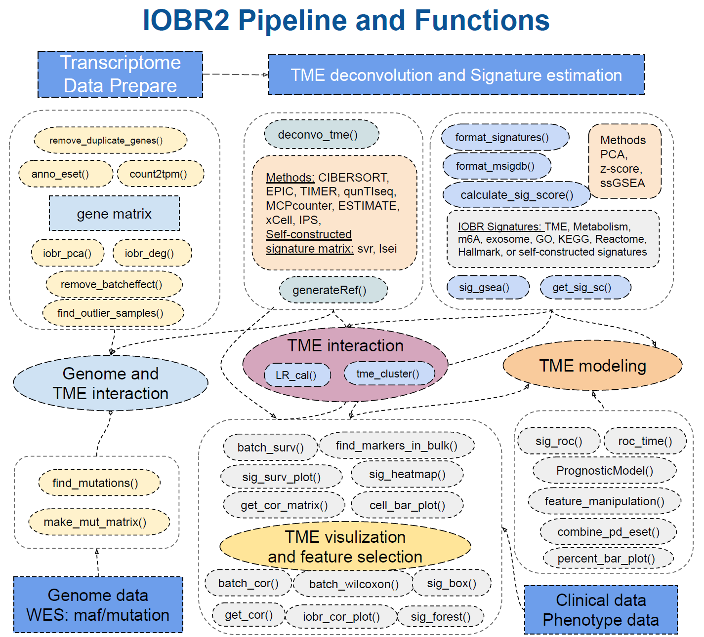

# **How to use IOBR**

## 🔍 The main pipeline of IOBR

<div class="figure" style="text-align: center">

<p class="caption">(\#fig:flowchart)The main pipeline of IOBR</p>
</div>

## 🗂 Main Functions of IOBR

* <div style="color:green">**Data Preparation: data annotation and transformation**</div> 
   * **count2tpm()**: transform gene expression count data into Transcripts Per Million (TPM) values. This function supports gene IDs of type "Ensembl", "Entrez", or "Symbol", and retrieves gene length information using either an online connection to the bioMart database or a local dataset (specified by the source parameter).
   * **anno_eset()**: annotate an ExpressionSet object (eset) with gene symbols using the provided annotation data.  It retains only the rows with probes that have matching identifiers in the annotation data. The function handles duplicates according to the specified method. The output is an annotated and cleaned expression set.
   * **remove_duplicate_genes()**: remove duplicate gene symbols from gene expression data. The retention of gene symbols is based either on their mean values (if method is set as "mean") or standard deviation values (if method is set as "sd").
   * **mouse2human_eset()**: convert mouse gene symbols to human gene symbols of expression set.
   * **find_outlier_samples()**: analyze gene expression data and identify potential outlier samples based on connectivity analysis. By utilizing the "WGCNA" package, this function calculates the normalized adjacency and connectivity z-scores for each sample. It also offers multiple parameters to customize analysis and visualization.
   * **remove_batcheffect()**: remove batch effects from given expression datasets and visualize the corrected data using principal component analysis (PCA). It takes three expression datasets as input and performs batch effect correction using the "sva::ComBat" or "sva::ComBat_seq" methods. The function then generates PCA plots to compare the data before and after correction.
   </br>

* <div style="color:green">**TME Deconvolution Module: integrate multiple algorithms to decode immune contexture**</div> 
   * **deconvo_tme()**: decode the TME infiltration using various deconvolution methodologies, based on bulk RNAseq, microarray or single cell RNAseq data. It currently supports methods include "CIBERSORT", "MCPcounter", "EPIC", "xCell", "IPS", "estimate", "quanTIseq", "TIMER", "SVR" and "lsei".
   * **generateRef()**: generate a novel gene reference data for specific feature deconvolution, such as infiltrating cell, utilizing different methods to identify differentially expressed genes (DEGs) . The function supports both "limma" and "DESeq2" methods.The resulting gene reference data can be used for **deconvo_tme()** with the "svr" and "lsei" algorithms.
   * **generateRef_seurat()**: take a Seurat object "sce" and additional parameters to perform various operations for generating reference gene expression data. It allows for specifying cell types, proportions, assays, preprocessing options, and statistical testing parameters.The resulting gene reference data can be used for **deconvo_tme()** with the "svr" and "lsei" algorithms.
</br>

* <div style="color:green">**Signature Module: calculating signature scores, estimate phenotype related signatures and corresponding genes, and evaluate signatures generated from single-cell RNA sequencing data **</div>
  * **calculate_sig_score()**: estimate the interested signatures enrolled in IOBR R package, which involves TME-associated, tumor-metabolism, and tumor-intrinsic signatures.The supported methods for signature score calculation include "PCA", "ssGSEA", "z-score", and Integration.
  * **feature_manipulation()**: manipulate features including the cell fraction and signatures generated from multi-omics data for latter analysis and model construction. Remove missing values, outliers and variables without significant variance.
  * **format_signatures()**: generate the object for **calculate_sig_score()** function, by inputting a data frame with signatures as column names of corresponding gene sets, and return a list contain the signature information for calculating multiple signature scores.
  * **format_msigdb()**: transform the signature gene sets data  with gmt format, which is not included in the signature collection and might be downloaded in the MSgiDB website, into the object of **calculate_sig_score()** function.
  * **sig_gsea()**: conduct Gene Set Enrichment Analysis (GSEA) to identify significant gene sets based on differential gene expression data. This function performs GSEA using the fgsea package and provides visualizations and results in the form of tables and plots. It supports the utilization of user-defined gene sets or the use of predefined gene sets from MSigDB. 
  * **get_sig_sc()**: get top gene signatures from single-cell differential analysis for **calculate_sig_score()** function. The input is a matrix containing a ranked list of putative markers, and associated statistics (p-values, ROC score, etc.)
</br>
    
* <div style="color:green">**Batch Analysis and Visualization: batch survival analysis and batch correlation analysis and other batch statistical analyses **</div>
  * **batch_surv()**: perform batch survival analysis. It calculates hazard ratios and confidence intervals for the specified variables based on the given data containing time-related information.
  * **subgroup_survival()**: extract hazard ratio and confidence intervals from a coxph object of subgroup analysis.
  * **batch_cor()**: batch analysis of correlation between two continuous variables using Pearson correlation coefficient or Spearman's rank correlation coefficient.
  * **batch_wilcoxon()**: perform Wilcoxon rank-sum tests on a given data set to compare the distribution of a specified feature between two groups. It computes the p-values and ranks the significant features based on the p-values. It returns a data frame with the feature names, p-values, adjusted p-values, logarithm of p-values, and a star rating based on the p-value ranges.
  * **batch_pcc()**: provide a batch way to calculate the partial correlation coefficient between feature and others when controlling a third variable.
  * **iobr_cor_plot()**: visualization of batch correlation analysis of signatures from "sig_group". Visualize the correlation between signature or phenotype with  expression of gene sets in target signature is also supported.
  * **cell_bar_plot()**: batch visualization of TME cell fraction, supporting input of deconvolution results from "CIBERSORT", "EPIC" and "quanTIseq" methodologies to further compare the TME cell distributions within one sample or among different samples.
  * **iobr_pca()**: perform Principal Component Analysis (PCA), which reduces the dimensionality of data while maintaining most of the original variance, and visualizes the PCA results on a scatter plot. 
  * **iobr_deg()**: perform differential expression analysis on gene expression data using the DESeq2 or limma method. It filters low count data, calculates fold changes and adjusted p-values, and identifies DEGs based on specified cutoffs. It also provides optional visualization tools such as volcano plots and heatmaps.
  * **get_cor()**: calculate and visualize the correlation between two variables in a dataset. It provides options to scale the data, handle missing values, and incorporate additional data. The function supports various correlation methods. It generates a correlation plot with optional subtypes or categories, including a regression line. 
  * **get_cor_matrix()**: calculate and visualize the correlation matrix between two sets of variables in a dataset. It provides flexibility in defining correlation methods, handling missing values, and incorporating additional data. The function supports various correlation methods, such as Pearson correlation, and displays the correlation result in a customizable plot.
  * **roc_time()**: generate a Receiver Operating Characteristic (ROC) plot over time to assess the predictive performance of one or more variables in survival analysis. It calculates the Area Under the Curve (AUC) for each specified time point and variable combination, and creates a multi-line ROC plot with corresponding AUC values annotated.
  * **sig_box()**: generate a boxplot with optional statistical comparisons. It takes in various parameters such as data, signature, variable, and more to customize the plot. It can be used to visualize and analyze data in a Seurat object or any other data frame.
  * **sig_heatmap()**: generate a heatmap plot based on input data, grouping variables, and optional conditions. The function allows customization of various parameters such as palette selection, scaling, color boxes, plot dimensions, and more. It provides flexibility in visualizing relationships between variables and groups in a concise and informative manner.
  * **sig_forest()**: create a forest plot for visualizing survival analysis results generated by "batch_surv".
  * **sig_roc()**: plot multiple ROC curves in a single graph, facilitating the comparison of different variables in terms of their ability to predict a binary response.
  * **sig_surv_plot()**: generat multiple Kaplan-Meier (KM) survival plots for a given signature or gene. It allows for detailed customization and is structured to handle various aspects of survival analysis.
  * **find_markers_in_bulk()**: find relevant results from the given gene expression data and meta information. It leverages the "Seurat" package to identify significant markers across multiple groups within the given data. The supported methods for comparison include "bootstrap", "delong" and  "venkatraman".
</br>

* <div style="color:green">**Signature Associated Mutation Module: identify and analyze mutations relevant to targeted signatures**</div>
  * **make_mut_matrix()**: transform the mutation data with MAF format(contain the columns of gene ID and the corresponding gene alterations which including SNP, indel and frameshift) into a mutation matrix in a suitable manner for further investigating signature relevant mutations.
  * **find_mutations()**: identify mutations associated with a distinct phenotype or signature. The function conducts the Cuzick test, Wilcoxon test, or both (when the method is set to "multi"). It generates box plots for the top genes identified through these statistical tests and creates oncoprints to graphically represent the mutation landscape across samples. 
</br>

* <div style="color:green">**Model Construction Module: feature selection and fast model construct to predict clinical phenotype**</div>
  * **BinomialModel()**: select features and construct a model to predict a binary phenotype. It accepts a dataset (x and y) as input and performs data processing, splitting into training and testing sets, and model fitting using both Lasso and Ridge regression techniques.
  * **PrognosticMode()**: select features and construct a model to predict clinical survival outcome. It primarily focuses on developing Lasso and Ridge regression models within the Cox proportional hazards framework.
  * **combine_pd_eset()**: combine the expression set (eset) with phenotype data (pdata).
  * **percent_bar_plot()**: create a percent bar plot based on the given data. The input is a data frame, with x and y-axis variables specified.
</br>


## 🌐 Current working environment


```r
library(IOBR)
```

```
## Loading required package: tibble
```

```
## Warning: package 'tibble' was built under R version 4.2.3
```

```
## Loading required package: dplyr
```

```
## Warning: package 'dplyr' was built under R version 4.2.3
```

```
## 
## Attaching package: 'dplyr'
```

```
## The following objects are masked from 'package:stats':
## 
##     filter, lag
```

```
## The following objects are masked from 'package:base':
## 
##     intersect, setdiff, setequal, union
```

```
## Loading required package: ggplot2
```

```
## Warning: package 'ggplot2' was built under R version 4.2.3
```

```
## Loading required package: ggpubr
```

```
## Warning: package 'ggpubr' was built under R version 4.2.3
```

```
## Loading required package: survival
```

```
## Loading required package: ComplexHeatmap
```

```
## Loading required package: grid
```

```
## ========================================
## ComplexHeatmap version 2.15.4
## Bioconductor page: http://bioconductor.org/packages/ComplexHeatmap/
## Github page: https://github.com/jokergoo/ComplexHeatmap
## Documentation: http://jokergoo.github.io/ComplexHeatmap-reference
## 
## If you use it in published research, please cite either one:
## - Gu, Z. Complex Heatmap Visualization. iMeta 2022.
## - Gu, Z. Complex heatmaps reveal patterns and correlations in multidimensional 
##     genomic data. Bioinformatics 2016.
## 
## 
## The new InteractiveComplexHeatmap package can directly export static 
## complex heatmaps into an interactive Shiny app with zero effort. Have a try!
## 
## This message can be suppressed by:
##   suppressPackageStartupMessages(library(ComplexHeatmap))
## ========================================
```

```
## Loading required package: tidyHeatmap
```

```
## Warning: package 'tidyHeatmap' was built under R version 4.2.3
```

```
## ========================================
## tidyHeatmap version 1.8.1
## If you use tidyHeatmap in published research, please cite:
## 1) Mangiola et al. tidyHeatmap: an R package for modular heatmap production 
##   based on tidy principles. JOSS 2020.
## 2) Gu, Z. Complex heatmaps reveal patterns and correlations in multidimensional 
##   genomic data. Bioinformatics 2016.
## This message can be suppressed by:
##   suppressPackageStartupMessages(library(tidyHeatmap))
## ========================================
```

```
## 
## Attaching package: 'tidyHeatmap'
```

```
## The following object is masked from 'package:stats':
## 
##     heatmap
```

```
## Loading required package: clusterProfiler
```

```
## 
```

```
## Registered S3 methods overwritten by 'treeio':
##   method              from    
##   MRCA.phylo          tidytree
##   MRCA.treedata       tidytree
##   Nnode.treedata      tidytree
##   Ntip.treedata       tidytree
##   ancestor.phylo      tidytree
##   ancestor.treedata   tidytree
##   child.phylo         tidytree
##   child.treedata      tidytree
##   full_join.phylo     tidytree
##   full_join.treedata  tidytree
##   groupClade.phylo    tidytree
##   groupClade.treedata tidytree
##   groupOTU.phylo      tidytree
##   groupOTU.treedata   tidytree
##   is.rooted.treedata  tidytree
##   nodeid.phylo        tidytree
##   nodeid.treedata     tidytree
##   nodelab.phylo       tidytree
##   nodelab.treedata    tidytree
##   offspring.phylo     tidytree
##   offspring.treedata  tidytree
##   parent.phylo        tidytree
##   parent.treedata     tidytree
##   root.treedata       tidytree
##   rootnode.phylo      tidytree
##   sibling.phylo       tidytree
```

```
## clusterProfiler v4.4.4  For help: https://yulab-smu.top/biomedical-knowledge-mining-book/
## 
## If you use clusterProfiler in published research, please cite:
## T Wu, E Hu, S Xu, M Chen, P Guo, Z Dai, T Feng, L Zhou, W Tang, L Zhan, X Fu, S Liu, X Bo, and G Yu. clusterProfiler 4.0: A universal enrichment tool for interpreting omics data. The Innovation. 2021, 2(3):100141
```

```
## 
## Attaching package: 'clusterProfiler'
```

```
## The following object is masked from 'package:stats':
## 
##     filter
```

```
## Loading required package: patchwork
```

```
## Warning: package 'patchwork' was built under R version 4.2.3
```

```
## Loading required package: survminer
```

```
## 
## Attaching package: 'survminer'
```

```
## The following object is masked from 'package:survival':
## 
##     myeloma
```

```
## ==========================================================================
##   IOBR v0.99.8  Immuno-Oncology Biological Research 
##   For Tutorial: https://iobr.github.io/book/
##   For Help: https://github.com/IOBR/IOBR/issues
## 
##  If you use IOBR in published research, please cite:
##  DQ Zeng, ZL Ye, RF Sheng, GC Yu, Y Xiong …, WJ Liao*.
##  IOBR: Multi-omics Immuno-Oncology Biological Research to decode 
##   tumor microenvironment and signatures. Frontiers in Immunology. 12:687975,(2021). 
##  DOI: 10.3389/fimmu.2021.687975
##  Higly Cited Paper and Hot Paper of WOS
## ==========================================================================
```

```r
sessionInfo()
```

```
## R version 4.2.0 (2022-04-22 ucrt)
## Platform: x86_64-w64-mingw32/x64 (64-bit)
## Running under: Windows 10 x64 (build 19045)
## 
## Matrix products: default
## 
## locale:
## [1] LC_COLLATE=Chinese (Simplified)_China.utf8 
## [2] LC_CTYPE=Chinese (Simplified)_China.utf8   
## [3] LC_MONETARY=Chinese (Simplified)_China.utf8
## [4] LC_NUMERIC=C                               
## [5] LC_TIME=Chinese (Simplified)_China.utf8    
## 
## attached base packages:
## [1] grid      stats     graphics  grDevices utils     datasets  methods  
## [8] base     
## 
## other attached packages:
##  [1] IOBR_0.99.8           survminer_0.4.9       patchwork_1.1.3      
##  [4] clusterProfiler_4.4.4 tidyHeatmap_1.8.1     ComplexHeatmap_2.15.4
##  [7] survival_3.3-1        ggpubr_0.6.0          ggplot2_3.4.4        
## [10] dplyr_1.1.2           tibble_3.2.1         
## 
## loaded via a namespace (and not attached):
##   [1] utf8_1.2.2                  tidyselect_1.2.0           
##   [3] RSQLite_2.3.2               AnnotationDbi_1.58.0       
##   [5] BiocParallel_1.30.3         lpSolve_5.6.19             
##   [7] scatterpie_0.2.1            ScaledMatrix_1.4.1         
##   [9] munsell_0.5.0               codetools_0.2-19           
##  [11] preprocessCore_1.58.0       withr_2.5.2                
##  [13] colorspace_2.0-3            GOSemSim_2.22.0            
##  [15] limSolve_1.5.7              Biobase_2.56.0             
##  [17] highr_0.10                  knitr_1.45                 
##  [19] rstudioapi_0.15.0           SingleCellExperiment_1.18.1
##  [21] stats4_4.2.0                ggsignif_0.6.4             
##  [23] DOSE_3.22.1                 MatrixGenerics_1.8.1       
##  [25] GenomeInfoDbData_1.2.8      KMsurv_0.1-5               
##  [27] polyclip_1.10-6             bit64_4.0.5                
##  [29] farver_2.1.1                rhdf5_2.40.0               
##  [31] downloader_0.4              vctrs_0.6.4                
##  [33] treeio_1.21.2               generics_0.1.3             
##  [35] xfun_0.40                   timechange_0.2.0           
##  [37] R6_2.5.1                    doParallel_1.0.17          
##  [39] GenomeInfoDb_1.34.4         clue_0.3-61                
##  [41] graphlayouts_1.0.1          rsvd_1.0.5                 
##  [43] locfit_1.5-9.8              rhdf5filters_1.8.0         
##  [45] bitops_1.0-7                cachem_1.0.6               
##  [47] fgsea_1.22.0                gridGraphics_0.5-1         
##  [49] DelayedArray_0.22.0         assertthat_0.2.1           
##  [51] scales_1.2.1                ggraph_2.1.0               
##  [53] enrichplot_1.16.2           gtable_0.3.4               
##  [55] beachmat_2.12.0             tidygraph_1.2.3            
##  [57] rlang_1.1.1                 genefilter_1.78.0          
##  [59] GlobalOptions_0.1.2         splines_4.2.0              
##  [61] rstatix_0.7.2               lazyeval_0.2.2             
##  [63] broom_1.0.5                 yaml_2.3.7                 
##  [65] reshape2_1.4.4              abind_1.4-5                
##  [67] backports_1.4.1             qvalue_2.28.0              
##  [69] tools_4.2.0                 bookdown_0.36              
##  [71] ggplotify_0.1.2             jquerylib_0.1.4            
##  [73] RColorBrewer_1.1-3          proxy_0.4-27               
##  [75] BiocGenerics_0.42.0         Rcpp_1.0.9                 
##  [77] plyr_1.8.7                  sparseMatrixStats_1.8.0    
##  [79] zlibbioc_1.42.0             purrr_1.0.2                
##  [81] RCurl_1.98-1.7              GetoptLong_1.0.5           
##  [83] viridis_0.6.4               cowplot_1.1.1              
##  [85] S4Vectors_0.34.0            zoo_1.8-10                 
##  [87] SummarizedExperiment_1.26.1 ggrepel_0.9.1              
##  [89] cluster_2.1.3               fs_1.5.2                   
##  [91] magrittr_2.0.3              data.table_1.14.2          
##  [93] DO.db_2.9                   circlize_0.4.15            
##  [95] matrixStats_0.62.0          GSVA_1.44.5                
##  [97] evaluate_0.22               xtable_1.8-4               
##  [99] XML_3.99-0.14               IRanges_2.30.0             
## [101] gridExtra_2.3               shape_1.4.6                
## [103] compiler_4.2.0              crayon_1.5.2               
## [105] shadowtext_0.1.2            htmltools_0.5.6.1          
## [107] ggfun_0.1.3                 geneplotter_1.74.0         
## [109] tidyr_1.3.0                 aplot_0.2.2                
## [111] lubridate_1.9.3             DBI_1.1.3                  
## [113] tweenr_2.0.2                corrplot_0.92              
## [115] MASS_7.3-60                 Matrix_1.6-3               
## [117] car_3.1-2                   cli_3.6.1                  
## [119] quadprog_1.5-8              parallel_4.2.0             
## [121] igraph_1.3.2                GenomicRanges_1.48.0       
## [123] pkgconfig_2.0.3             km.ci_0.5-6                
## [125] foreach_1.5.2               ggtree_3.4.4               
## [127] annotate_1.74.0             bslib_0.5.1                
## [129] XVector_0.36.0              yulab.utils_0.1.0          
## [131] stringr_1.5.0               digest_0.6.29              
## [133] graph_1.74.0                Biostrings_2.64.0          
## [135] rmarkdown_2.25              fastmatch_1.1-4            
## [137] survMisc_0.5.6              tidytree_0.4.5             
## [139] dendextend_1.17.1           DelayedMatrixStats_1.18.2  
## [141] GSEABase_1.58.0             rjson_0.2.21               
## [143] lifecycle_1.0.3             nlme_3.1-157               
## [145] jsonlite_1.8.0              Rhdf5lib_1.18.2            
## [147] carData_3.0-5               viridisLite_0.4.2          
## [149] limma_3.52.4                fansi_1.0.3                
## [151] pillar_1.9.0                lattice_0.20-45            
## [153] KEGGREST_1.36.3             fastmap_1.1.1              
## [155] httr_1.4.7                  GO.db_3.15.0               
## [157] emo_0.0.0.9000              glue_1.6.2                 
## [159] png_0.1-7                   iterators_1.0.14           
## [161] glmnet_4.1-8                bit_4.0.5                  
## [163] HDF5Array_1.24.2            ggforce_0.4.1              
## [165] class_7.3-22                stringi_1.7.6              
## [167] sass_0.4.7                  blob_1.2.4                 
## [169] BiocSingular_1.12.0         DESeq2_1.36.0              
## [171] memoise_2.0.1               irlba_2.3.5                
## [173] tidyverse_2.0.0             e1071_1.7-13               
## [175] ape_5.6-2
```
