# **Some tips about IOBR**

In this section, we'll cover some of the tips inside the IOBR package in terms of data processing and visualisation.

## Loading packages


```r
library(IOBR)
```

## Colour Configuration

### categorical variable
In IOBR, we created a function for get_col. The user can get the colours with some parameters in it. Please refer to the following example. In order to better suit the requirements of the journal, we have provided some of the more commonly used colour schemes. These include `nrc`, `jama`, `aaas`, `jco`, `paired1`, `paired2`, `paired3`, `paired4`, `accent`, `set2`.


```r
cols <- get_cols(palette = "jama", show_col = T)
```

```
## [1] "'#374E55FF', '#DF8F44FF', '#00A1D5FF', '#B24745FF', '#79AF97FF', '#6A6599FF', '#80796BFF'"
```

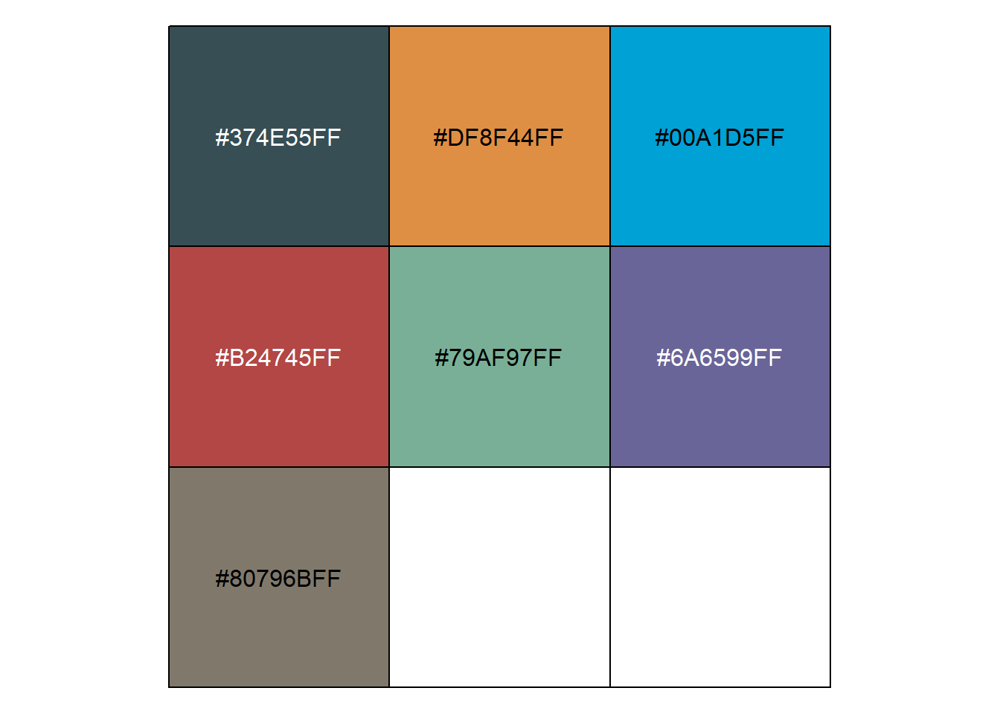

```r
cols
```

```
## [1] "#374E55FF" "#DF8F44FF" "#00A1D5FF" "#B24745FF" "#79AF97FF" "#6A6599FF"
## [7] "#80796BFF"
```

```r
cols <- get_cols( palette = "jco", show_col = T)
```

```
## [1] "'#0073C2FF', '#EFC000FF', '#868686FF', '#CD534CFF', '#7AA6DCFF', '#003C67FF', '#8F7700FF', '#3B3B3BFF', '#A73030FF'"
```

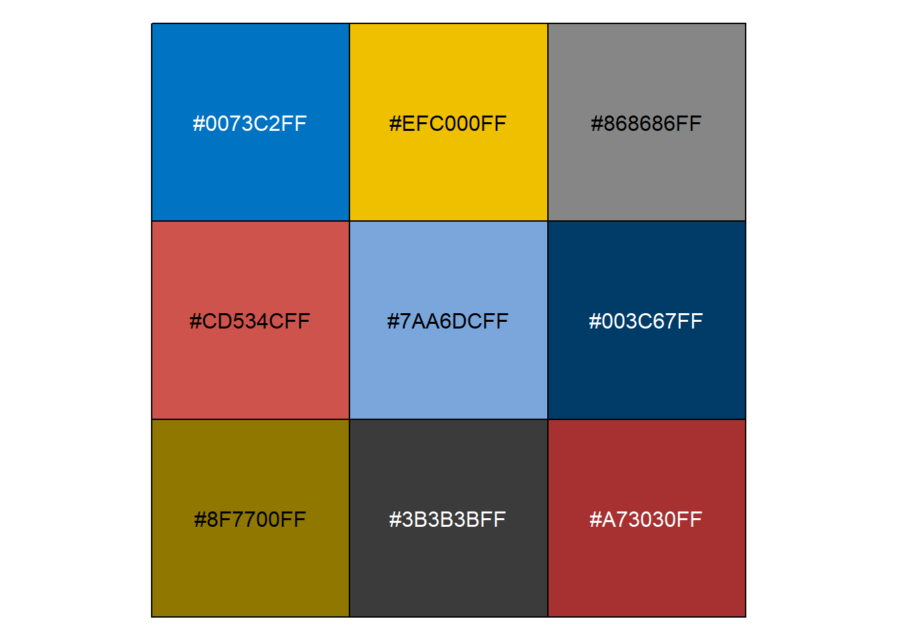

```r
cols
```

```
## [1] "#0073C2FF" "#EFC000FF" "#868686FF" "#CD534CFF" "#7AA6DCFF" "#003C67FF"
## [7] "#8F7700FF" "#3B3B3BFF" "#A73030FF"
```


```r
cols <- get_cols(palette = "nrc", show_col = T)
```

```
## [1] "'#E64B35FF', '#4DBBD5FF', '#00A087FF', '#3C5488FF', '#F39B7FFF', '#8491B4FF', '#91D1C2FF', '#DC0000FF', '#7E6148FF'"
```

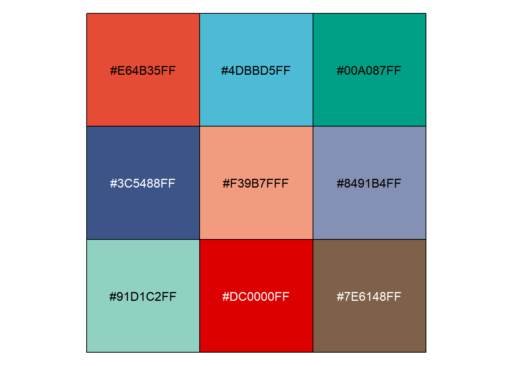

```r
cols
```

```
## [1] "#E64B35FF" "#4DBBD5FF" "#00A087FF" "#3C5488FF" "#F39B7FFF" "#8491B4FF"
## [7] "#91D1C2FF" "#DC0000FF" "#7E6148FF"
```


```r
cols <- get_cols(palette = "aaas", show_col = T)
```

```
## [1] "'#3B4992FF', '#EE0000FF', '#008B45FF', '#631879FF', '#008280FF', '#BB0021FF', '#5F559BFF', '#A20056FF', '#808180FF'"
```

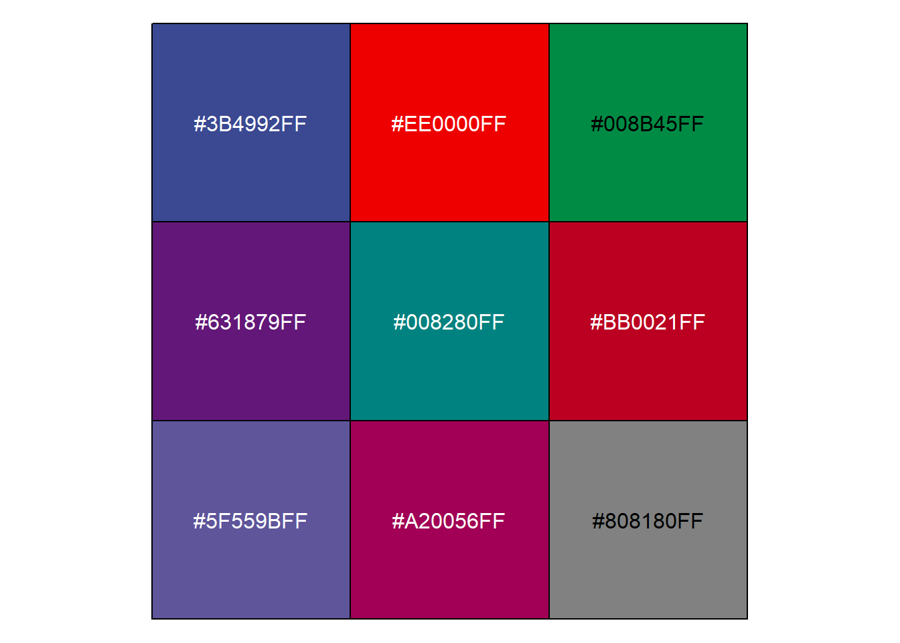

```r
cols
```

```
## [1] "#3B4992FF" "#EE0000FF" "#008B45FF" "#631879FF" "#008280FF" "#BB0021FF"
## [7] "#5F559BFF" "#A20056FF" "#808180FF"
```

```r
cols <- get_cols(palette = "paired4", show_col = T)
```

```
## [1] "'#FDBF6F', '#FF7F00', '#CAB2D6', '#6A3D9A', '#FFFF99'"
```

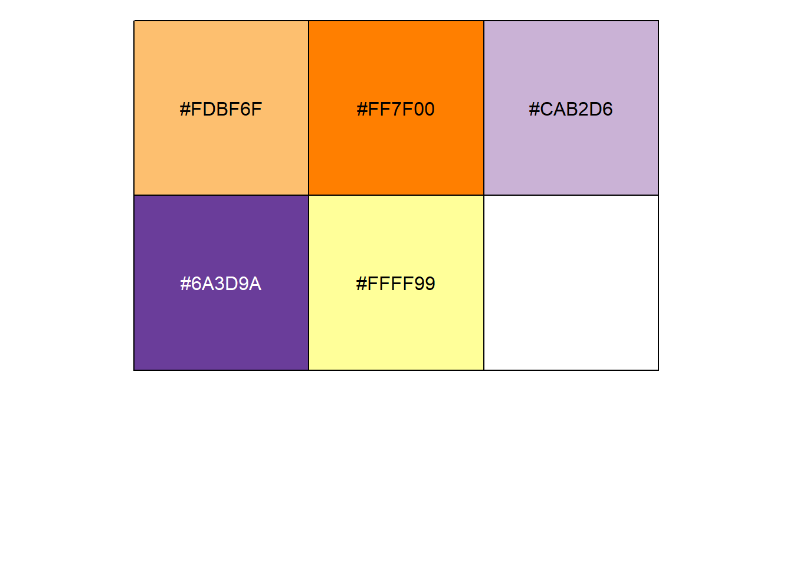

```r
cols
```

```
## [1] "#FDBF6F" "#FF7F00" "#CAB2D6" "#6A3D9A" "#FFFF99"
```


```r
cols <- get_cols(palette = "set2", show_col = T)
```

```
## [1] "'#66C2A5', '#FC8D62', '#8DA0CB', '#E78AC3', '#A6D854', '#FFD92F', '#E5C494'"
```

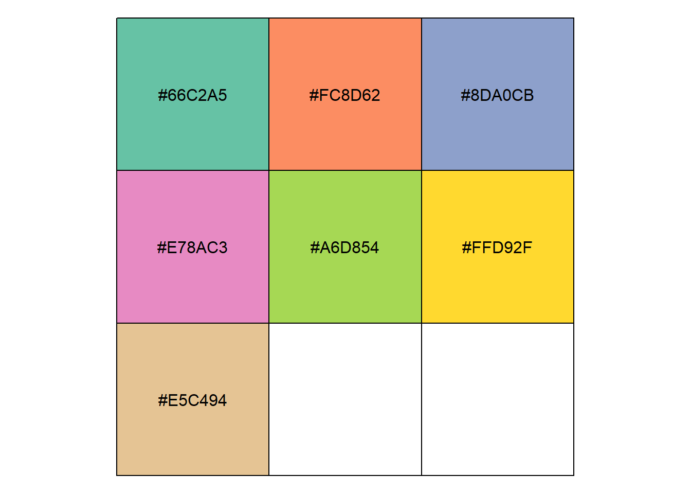

```r
cols
```

```
## [1] "#66C2A5" "#FC8D62" "#8DA0CB" "#E78AC3" "#A6D854" "#FFD92F" "#E5C494"
```

### Higher number of subgroups
In order to cope with multiple groupings, we have selected some colours that are more identifiable with each other and stored these colourways in the objects palette1-4. The user can obtain them by setting the parameter `palette`.


```r
cols <- get_cols(palette = 1, show_col = T)
```

```
## >>>>=== Palette option for random: 1: palette1; 2: palette2; 3: palette3;  4: palette4
```

```
## [1] "'#5f75ae', '#64a841', '#e5486e', '#de8e06', '#b5aa0f', '#7ba39d', '#b15928', '#6a3d9a', '#cab2d6', '#374E55FF', '#00A1D5FF', '#6A6599FF', '#80796BFF', '#e31a1c', '#fb9a99', '#1f78b4', '#a6cee3', '#008280FF', '#3C5488FF', '#8F7700FF', '#666666', '#A20056FF', '#fdbf6f', '#E78AC3', '#b2df8a', '#386CB0', '#CD534CFF', '#008B45FF', '#7AA6DCFF', '#00A087FF', '#A73030FF', '#631879FF', '#003C67FF'"
```

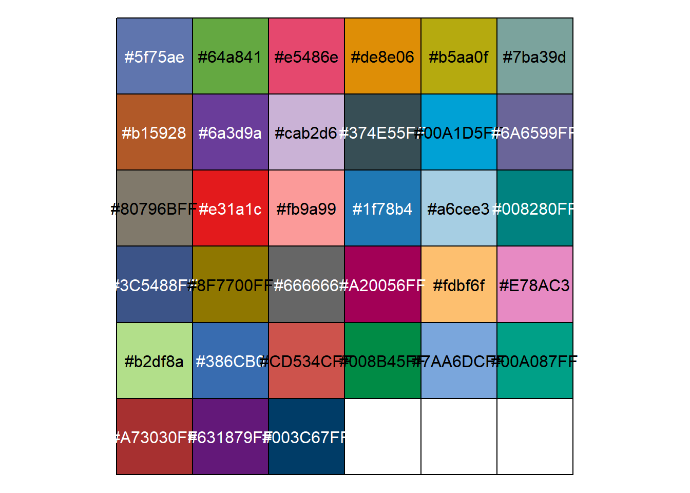

```r
cols
```

```
##  [1] "#5f75ae"   "#64a841"   "#e5486e"   "#de8e06"   "#b5aa0f"   "#7ba39d"  
##  [7] "#b15928"   "#6a3d9a"   "#cab2d6"   "#374E55FF" "#00A1D5FF" "#6A6599FF"
## [13] "#80796BFF" "#e31a1c"   "#fb9a99"   "#1f78b4"   "#a6cee3"   "#008280FF"
## [19] "#3C5488FF" "#8F7700FF" "#666666"   "#A20056FF" "#fdbf6f"   "#E78AC3"  
## [25] "#b2df8a"   "#386CB0"   "#CD534CFF" "#008B45FF" "#7AA6DCFF" "#00A087FF"
## [31] "#A73030FF" "#631879FF" "#003C67FF"
```

### Gradient colour or heatmap colour scheme


```r
palettes(category = "continue", palette = "puor", show_col = TRUE, show_message = TRUE)
```

```
## There are seven categories you can choose: box, continue2, continue, random, heatmap, heatmap3, tidyheatmap
```

```
## There are four palettes you can choose: rdbu, puor, blues, reds
```

```
## [1] "'#7F3B08', '#B35806', '#E08214', '#FDB863', '#FEE0B6', '#F7F7F7', '#D8DAEB', '#B2ABD2', '#8073AC', '#542788', '#2D004B'"
```

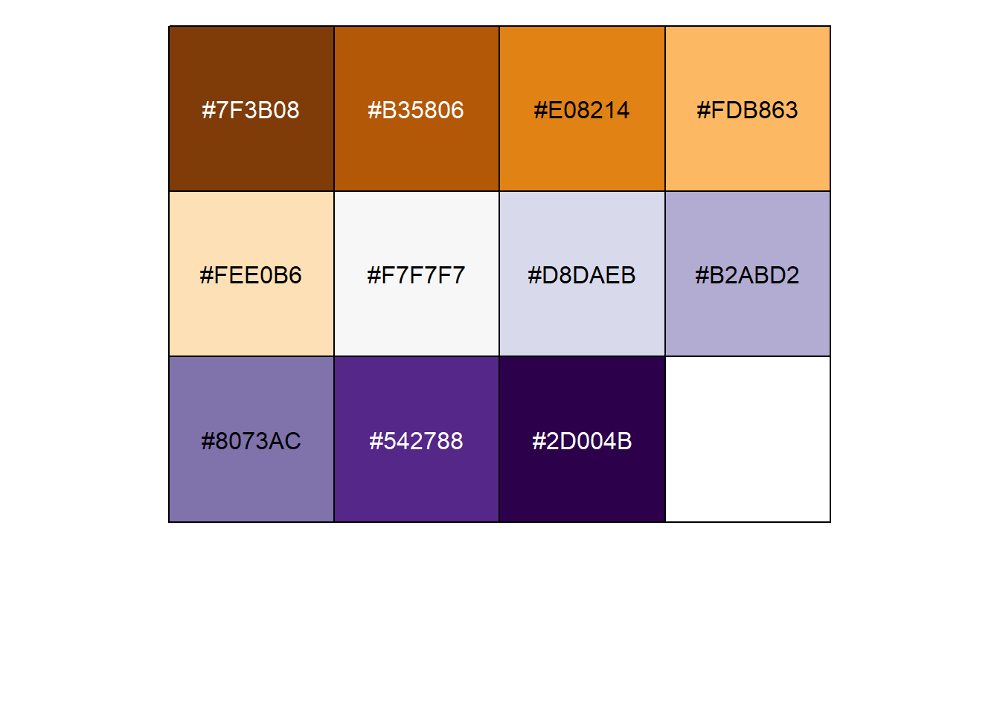

```
##  [1] "#7F3B08" "#B35806" "#E08214" "#FDB863" "#FEE0B6" "#F7F7F7" "#D8DAEB"
##  [8] "#B2ABD2" "#8073AC" "#542788" "#2D004B"
```


```r
palettes(category = "continue", palette = "rdbu", show_col = TRUE, show_message = TRUE)
```

```
## There are seven categories you can choose: box, continue2, continue, random, heatmap, heatmap3, tidyheatmap
```

```
## There are four palettes you can choose: rdbu, puor, blues, reds
```

```
## [1] "'#67001F', '#B2182B', '#D6604D', '#F4A582', '#FDDBC7', '#F7F7F7', '#D1E5F0', '#92C5DE', '#4393C3', '#2166AC', '#053061'"
```

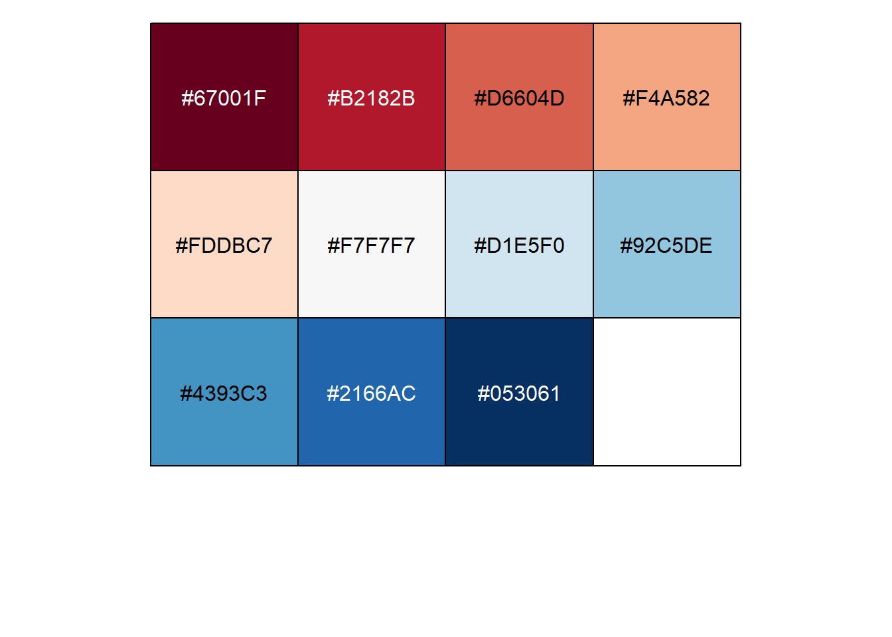

```
##  [1] "#67001F" "#B2182B" "#D6604D" "#F4A582" "#FDDBC7" "#F7F7F7" "#D1E5F0"
##  [8] "#92C5DE" "#4393C3" "#2166AC" "#053061"
```

```r
palettes(category = "continue", palette = "blues", show_col = TRUE, show_message = TRUE)
```

```
## There are seven categories you can choose: box, continue2, continue, random, heatmap, heatmap3, tidyheatmap
```

```
## There are four palettes you can choose: rdbu, puor, blues, reds
```

```
## Warning in RColorBrewer::brewer.pal(11, "Blues"): n too large, allowed maximum for palette Blues is 9
## Returning the palette you asked for with that many colors
```

```
## [1] "'#F7FBFF', '#DEEBF7', '#C6DBEF', '#9ECAE1', '#6BAED6', '#4292C6', '#2171B5', '#08519C', '#08306B'"
```

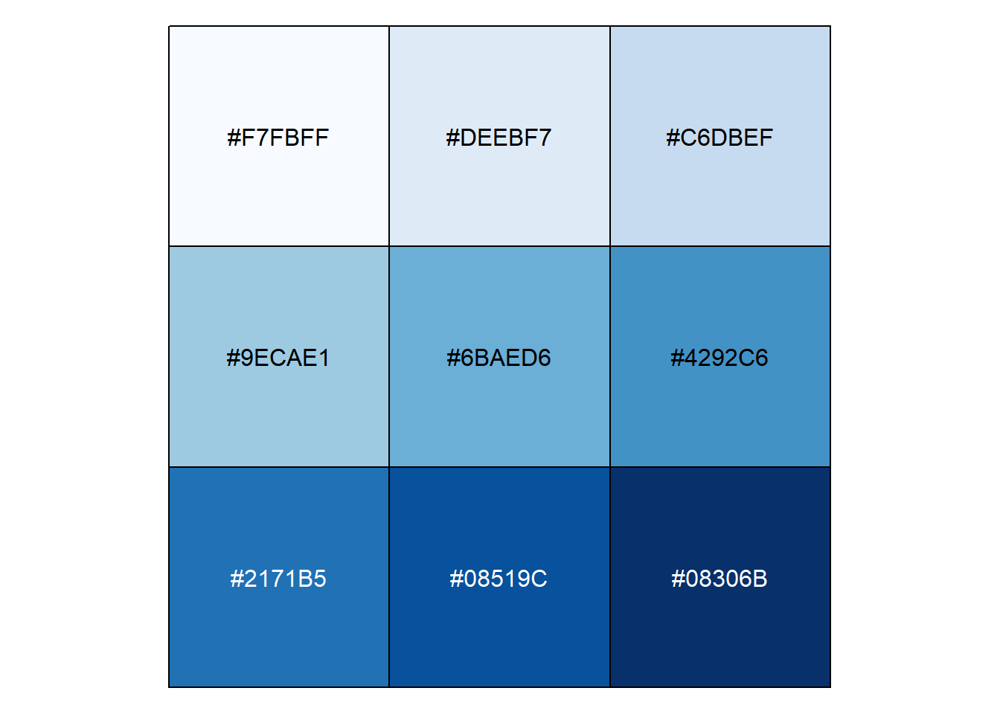

```
## [1] "#F7FBFF" "#DEEBF7" "#C6DBEF" "#9ECAE1" "#6BAED6" "#4292C6" "#2171B5"
## [8] "#08519C" "#08306B"
```


```r
palettes(category = "continue", palette = "reds", show_col = TRUE, show_message = TRUE)
```

```
## There are seven categories you can choose: box, continue2, continue, random, heatmap, heatmap3, tidyheatmap
```

```
## There are four palettes you can choose: rdbu, puor, blues, reds
```

```
## Warning in RColorBrewer::brewer.pal(11, "Reds"): n too large, allowed maximum for palette Reds is 9
## Returning the palette you asked for with that many colors
```

```
## [1] "'#FFF5F0', '#FEE0D2', '#FCBBA1', '#FC9272', '#FB6A4A', '#EF3B2C', '#CB181D', '#A50F15', '#67000D'"
```

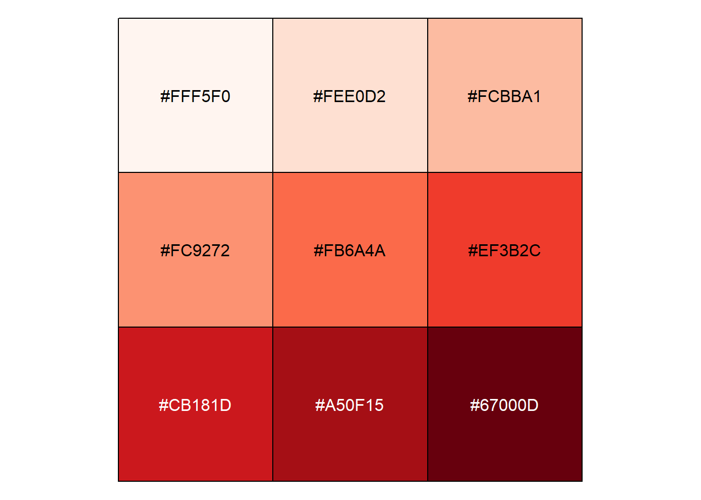

```
## [1] "#FFF5F0" "#FEE0D2" "#FCBBA1" "#FC9272" "#FB6A4A" "#EF3B2C" "#CB181D"
## [8] "#A50F15" "#67000D"
```

For heatmap colour configuration, usually more colours are needed. Users can adjust the number of colours to be returned by setting the parameter `category` to heatmap and by adjusting `count`. In IOBR, we offer a total of 7 colour schemes. Users can choose the colour scheme by setting the palette.

```r
palettes(category = "heatmap", palette = "1", counts = 20, show_col = TRUE, show_message = TRUE)
```

```
## There are seven categories you can choose: box, continue2, continue, random, heatmap, heatmap3, tidyheatmap
```

```
## There are five palettes you can choose: 1 = pheatmap,  2 = peach,  3 = blues, 4 = virids, 5 = reds, 6 = RdBu, 7 = navy_firebrick
```

```
## [1] "'#4575B4', '#5D8CC0', '#75A3CC', '#8CBBD8', '#A5CCE2', '#BEDDEB', '#D7EDF4', '#E6F5EC', '#F0F9DA', '#FAFDC8', '#FEFAB7', '#FEF0A8', '#FEE699', '#FDD78A', '#FDBD78', '#FCA267', '#FA8856', '#EE6A46', '#E24D36', '#D73027'"
```


```
##  [1] "#4575B4" "#5D8CC0" "#75A3CC" "#8CBBD8" "#A5CCE2" "#BEDDEB" "#D7EDF4"
##  [8] "#E6F5EC" "#F0F9DA" "#FAFDC8" "#FEFAB7" "#FEF0A8" "#FEE699" "#FDD78A"
## [15] "#FDBD78" "#FCA267" "#FA8856" "#EE6A46" "#E24D36" "#D73027"
```

```r
palettes(category = "heatmap", palette = "2", counts = 20, show_col = TRUE, show_message = TRUE)
```

```
## There are seven categories you can choose: box, continue2, continue, random, heatmap, heatmap3, tidyheatmap
```

```
## There are five palettes you can choose: 1 = pheatmap,  2 = peach,  3 = blues, 4 = virids, 5 = reds, 6 = RdBu, 7 = navy_firebrick
```

```
## [1] "'#3182BD', '#468FC3', '#5C9CCA', '#72A9D1', '#87B6D8', '#9DC3DF', '#B3D0E6', '#C8DEED', '#DEEBF4', '#F4F8FB', '#FDF3F7', '#F9DBE9', '#F6C3DB', '#F2ABCC', '#EE93BE', '#EB7BB0', '#E763A1', '#E44B93', '#E03385', '#DD1C77'"
```

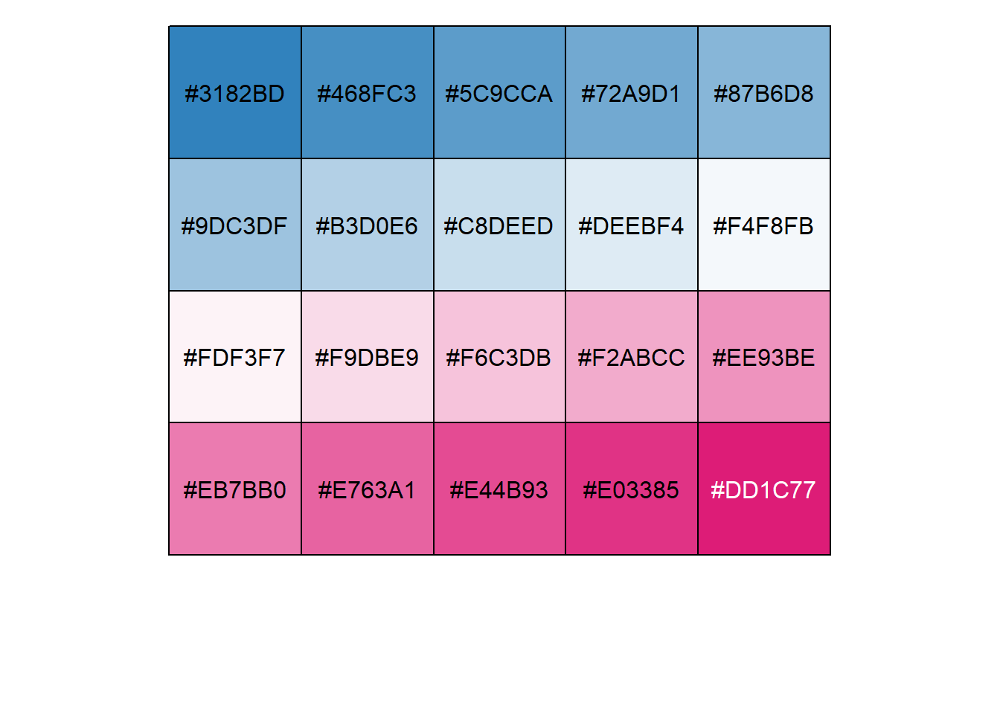

```
##  [1] "#3182BD" "#468FC3" "#5C9CCA" "#72A9D1" "#87B6D8" "#9DC3DF" "#B3D0E6"
##  [8] "#C8DEED" "#DEEBF4" "#F4F8FB" "#FDF3F7" "#F9DBE9" "#F6C3DB" "#F2ABCC"
## [15] "#EE93BE" "#EB7BB0" "#E763A1" "#E44B93" "#E03385" "#DD1C77"
```

```r
palettes(category = "heatmap", palette = "3", counts = 20, show_col = TRUE, show_message = TRUE)
```

```
## There are seven categories you can choose: box, continue2, continue, random, heatmap, heatmap3, tidyheatmap
```

```
## There are five palettes you can choose: 1 = pheatmap,  2 = peach,  3 = blues, 4 = virids, 5 = reds, 6 = RdBu, 7 = navy_firebrick
```

```
## [1] "'#084594', '#1155A0', '#1A65AC', '#2474B6', '#3080BD', '#3C8CC3', '#4A97C9', '#59A2CF', '#68ACD5', '#7BB6D9', '#8DC1DD', '#A0CAE1', '#AED1E6', '#BDD7EC', '#C9DDF0', '#D2E3F3', '#DBE9F6', '#E4EFF9', '#EDF5FC', '#F7FBFF'"
```

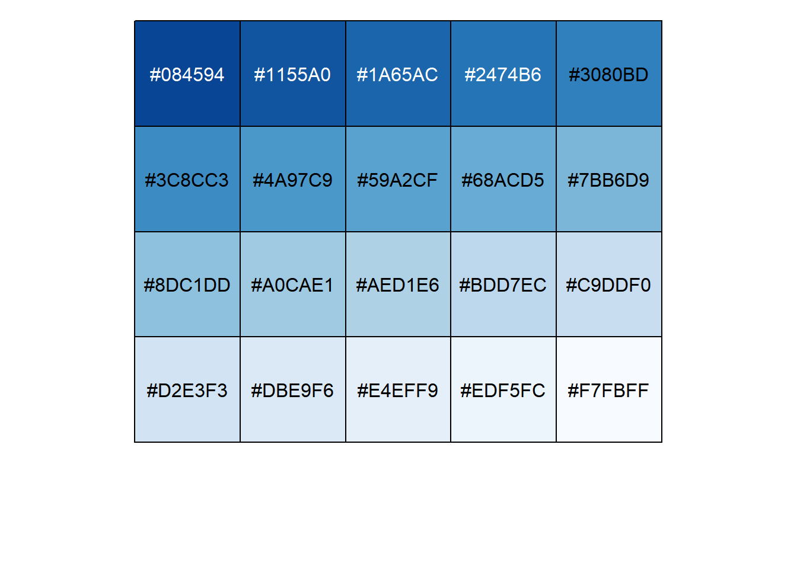

```
##  [1] "#084594" "#1155A0" "#1A65AC" "#2474B6" "#3080BD" "#3C8CC3" "#4A97C9"
##  [8] "#59A2CF" "#68ACD5" "#7BB6D9" "#8DC1DD" "#A0CAE1" "#AED1E6" "#BDD7EC"
## [15] "#C9DDF0" "#D2E3F3" "#DBE9F6" "#E4EFF9" "#EDF5FC" "#F7FBFF"
```

```r
palettes(category = "heatmap", palette = "7", counts = 20, show_col = TRUE, show_message = TRUE)
```

```
## There are seven categories you can choose: box, continue2, continue, random, heatmap, heatmap3, tidyheatmap
```

```
## There are five palettes you can choose: 1 = pheatmap,  2 = peach,  3 = blues, 4 = virids, 5 = reds, 6 = RdBu, 7 = navy_firebrick
```

```
## [1] "'#000080', '#1A1A8D', '#35359A', '#5050A8', '#6B6BB5', '#8686C2', '#A1A1D0', '#BBBBDD', '#D6D6EA', '#F1F1F8', '#FAF3F3', '#F2DCDC', '#EAC4C4', '#E2ADAD', '#DA9696', '#D27F7F', '#CA6767', '#C25050', '#BA3939', '#B22222'"
```

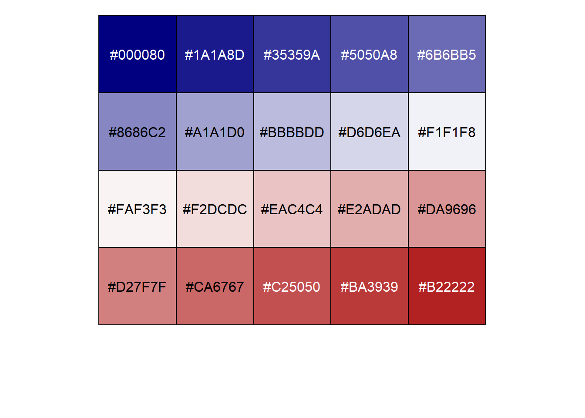

```
##  [1] "#000080" "#1A1A8D" "#35359A" "#5050A8" "#6B6BB5" "#8686C2" "#A1A1D0"
##  [8] "#BBBBDD" "#D6D6EA" "#F1F1F8" "#FAF3F3" "#F2DCDC" "#EAC4C4" "#E2ADAD"
## [15] "#DA9696" "#D27F7F" "#CA6767" "#C25050" "#BA3939" "#B22222"
```


