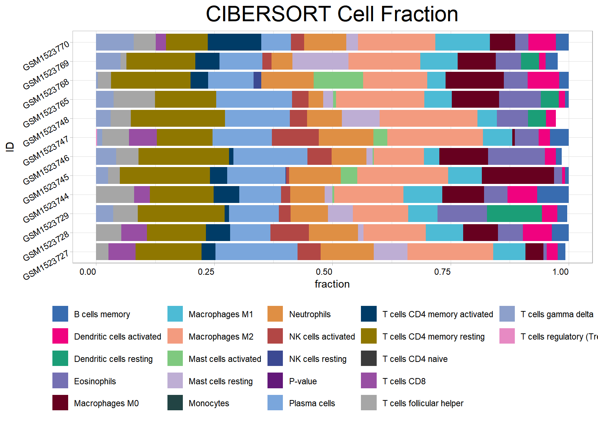
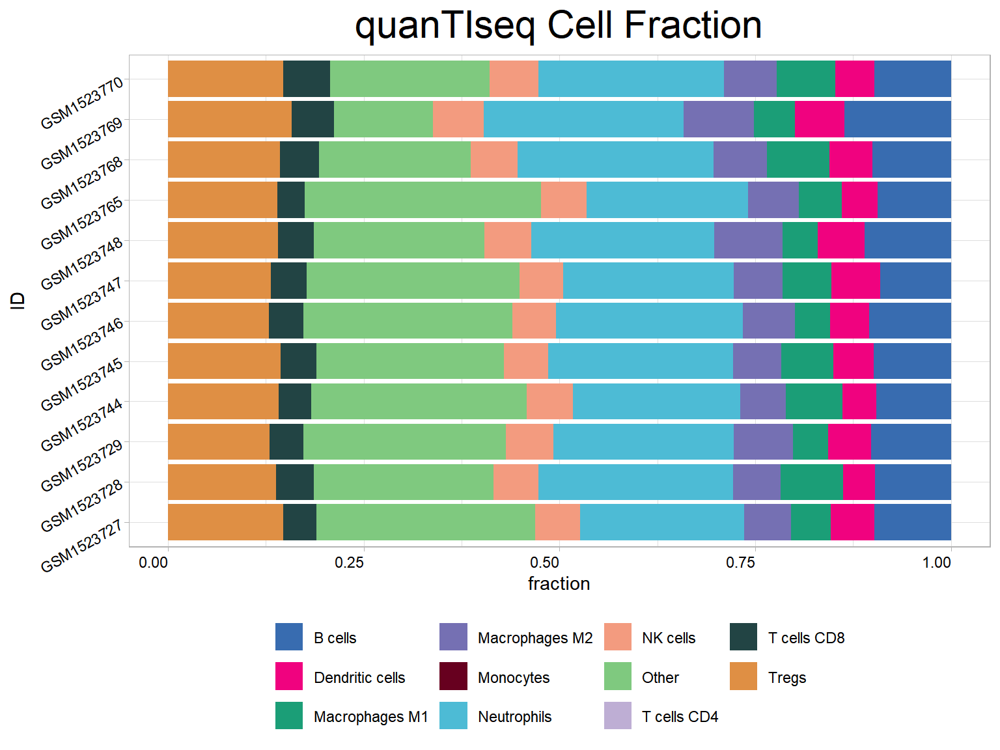
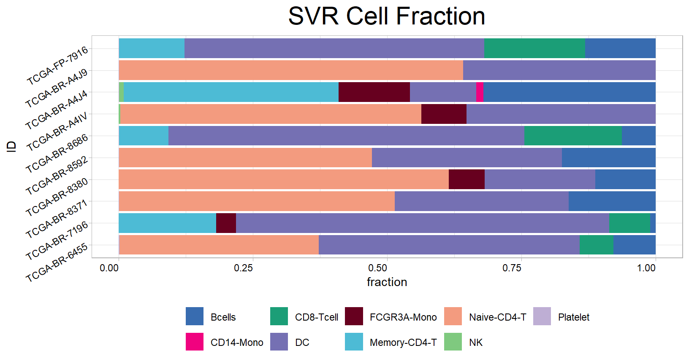

# **TME deconvolution**

This section demonstrates various algorithms for parsing the tumour microenvironment using data from the bulk transcriptome. We also describe how to construct the reference signature matrix for the popular SVR algorithm (CIBERSORT) from single-cell data.

## Loading packages
Load the IOBR package in your R session after the installation is complete:

``` r
library(IOBR)
library(survminer)
library(tidyverse)
options(future.globals.maxSize = 8 * 1024^3)
```

## Downloading data for example
Obtaining data set from GEO [Gastric cancer: GSE62254](https://pubmed.ncbi.nlm.nih.gov/25894828/) using `GEOquery` R package.

``` r
if (!requireNamespace("GEOquery", quietly = TRUE))  BiocManager::install("GEOquery")
library("GEOquery")
# NOTE: This process may take a few minutes which depends on the internet connection speed. Please wait for its completion.
eset_geo <- getGEO(GEO = "GSE62254", getGPL  = F, destdir = "./")
eset    <- eset_geo[[1]]
eset    <- exprs(eset)
eset[1:5, 1:5]
```

```
##           GSM1523727 GSM1523728 GSM1523729 GSM1523744 GSM1523745
## 1007_s_at  3.2176645  3.0624323  3.0279131   2.921683  2.8456013
## 1053_at    2.4050109  2.4394879  2.2442708   2.345916  2.4328582
## 117_at     1.4933412  1.8067380  1.5959665   1.839822  1.8326058
## 121_at     2.1965561  2.2812181  2.1865556   2.258599  2.1874363
## 1255_g_at  0.8698382  0.9502466  0.8125414   1.012860  0.9441993
```

Annotation of genes in the expression matrix and removal of duplicate genes.

``` r
library(IOBR)

# Load the annotation file `anno_hug133plus2` in IOBR.
head(anno_hug133plus2)
```

```
## # A tibble: 6 × 2
##   probe_id  symbol 
##   <fct>     <fct>  
## 1 1007_s_at MIR4640
## 2 1053_at   RFC2   
## 3 117_at    HSPA6  
## 4 121_at    PAX8   
## 5 1255_g_at GUCA1A 
## 6 1294_at   MIR5193
```

``` r
# Conduct gene annotation using `anno_hug133plus2` file; If identical gene symbols exists, these genes would be ordered by the mean expression levels. The gene symbol with highest mean expression level is selected and remove others. 

eset<-anno_eset(eset       = eset,
                annotation = anno_hug133plus2,
                symbol     = "symbol",
                probe      = "probe_id",
                method     = "mean")
eset[1:5, 1:3]
```

```
##              GSM1523727 GSM1523728 GSM1523729
## SH3KBP1        4.327974   4.316195   4.351425
## RPL41          4.246149   4.246808   4.257940
## EEF1A1         4.293762   4.291038   4.262199
## COX2           4.250288   4.283714   4.270508
## LOC101928826   4.219303   4.219670   4.213252
```

## Available Methods to Decode TME Contexture


``` r
tme_deconvolution_methods
```

```
##         MCPcounter               EPIC              xCell          CIBERSORT 
##       "mcpcounter"             "epic"            "xcell"        "cibersort" 
## CIBERSORT Absolute                IPS           ESTIMATE                SVR 
##    "cibersort_abs"              "ips"         "estimate"              "svr" 
##               lsei              TIMER          quanTIseq 
##             "lsei"            "timer"        "quantiseq"
```

``` r
# Return available parameter options of deconvolution methods
```

The input data is a matrix subseted from ESET of ACRG cohort, with genes in rows and samples in columns. The row name must be HGNC symbols and the column name must be sample names.

``` r
eset_acrg <- eset[, 1:50]
eset_acrg[1:5, 1:3]
```

```
##              GSM1523727 GSM1523728 GSM1523729
## SH3KBP1        4.327974   4.316195   4.351425
## RPL41          4.246149   4.246808   4.257940
## EEF1A1         4.293762   4.291038   4.262199
## COX2           4.250288   4.283714   4.270508
## LOC101928826   4.219303   4.219670   4.213252
```
Check detail parameters of the function

``` r
# help(deconvo_tme)
```

## Method 1: CIBERSORT

``` r
cibersort<-deconvo_tme(eset = eset_acrg, method = "cibersort", arrays = TRUE, perm = 100 )
```

```
## 
## >>> Running CIBERSORT
```

``` r
# head(cibersort)
res<-cell_bar_plot(input = cibersort[1:12,], features = colnames(cibersort)[3:24], title = "CIBERSORT Cell Fraction")
```

```
## There are seven categories you can choose: box, continue2, continue, random, heatmap, heatmap3, tidyheatmap
```

```
## >>>>=== Palette option for random: 1: palette1; 2: palette2; 3: palette3;  4: palette4
```



## Method 2: EPIC

``` r
# help(deconvo_epic)
epic<-deconvo_tme(eset = eset_acrg, method = "epic", arrays = TRUE)
```

```
## 
## >>> Running EPIC
```

```
## Warning in IOBR::EPIC(bulk = eset, reference = ref, mRNA_cell = NULL, scaleExprs = TRUE): The optimization didn't fully converge for some samples:
## GSM1523744; GSM1523746; GSM1523781; GSM1523786
##  - check fit.gof for the convergeCode and convergeMessage
```

```
## Warning in IOBR::EPIC(bulk = eset, reference = ref, mRNA_cell = NULL,
## scaleExprs = TRUE): mRNA_cell value unknown for some cell types: CAFs,
## Endothelial - using the default value of 0.4 for these but this might bias the
## true cell proportions from all cell types.
```

``` r
head(epic)
```

```
## # A tibble: 6 × 9
##   ID      Bcells_EPIC CAFs_EPIC CD4_Tcells_EPIC CD8_Tcells_EPIC Endothelial_EPIC
##   <chr>         <dbl>     <dbl>           <dbl>           <dbl>            <dbl>
## 1 GSM152…      0.0292   0.00888           0.145          0.0756           0.0876
## 2 GSM152…      0.0293   0.0109            0.159          0.0745           0.0954
## 3 GSM152…      0.0308   0.0106            0.149          0.0732           0.0941
## 4 GSM152…      0.0273   0.0108            0.145          0.0704           0.0860
## 5 GSM152…      0.0280   0.0111            0.151          0.0707           0.0928
## 6 GSM152…      0.0320   0.00958           0.148          0.0716           0.0907
## # ℹ 3 more variables: Macrophages_EPIC <dbl>, NKcells_EPIC <dbl>,
## #   otherCells_EPIC <dbl>
```

## Method 3: MCPcounter

``` r
mcp<-deconvo_tme(eset = eset_acrg, method = "mcpcounter")
```

```
## 
## >>> Running MCP-counter
```

``` r
head(mcp)
```

```
## # A tibble: 6 × 11
##   ID         T_cells_MCPcounter CD8_T_cells_MCPcounter Cytotoxic_lymphocytes_M…¹
##   <chr>                   <dbl>                  <dbl>                     <dbl>
## 1 GSM1523727               1.47                  1.11                       1.33
## 2 GSM1523728               1.53                  1.05                       1.60
## 3 GSM1523729               1.47                  1.07                       1.37
## 4 GSM1523744               1.46                  1.02                       1.44
## 5 GSM1523745               1.51                  1.10                       1.49
## 6 GSM1523746               1.51                  0.992                      1.40
## # ℹ abbreviated name: ¹​Cytotoxic_lymphocytes_MCPcounter
## # ℹ 7 more variables: B_lineage_MCPcounter <dbl>, NK_cells_MCPcounter <dbl>,
## #   Monocytic_lineage_MCPcounter <dbl>,
## #   Myeloid_dendritic_cells_MCPcounter <dbl>, Neutrophils_MCPcounter <dbl>,
## #   Endothelial_cells_MCPcounter <dbl>, Fibroblasts_MCPcounter <dbl>
```

## Method 4: xCELL

``` r
xcell<-deconvo_tme(eset = eset_acrg, method = "xcell", arrays = TRUE)
```

``` r
head(xcell)
```

```
## # A tibble: 6 × 68
##   ID         aDC_xCell Adipocytes_xCell Astrocytes_xCell `B-cells_xCell`
##   <chr>          <dbl>            <dbl>            <dbl>           <dbl>
## 1 GSM1523727 0                 0.000346         3.06e-20        4.10e- 5
## 2 GSM1523728 0.000221          0.000255         0               4.89e- 5
## 3 GSM1523729 0.0000141         0.000490         5.19e-20        5.24e-22
## 4 GSM1523744 0.000110          0.000395         2.34e-21        6.00e- 5
## 5 GSM1523745 0.000100          0.000259         0               2.39e- 5
## 6 GSM1523746 0.0000415         0.000266         3.90e-20        6.37e- 5
## # ℹ 63 more variables: Basophils_xCell <dbl>,
## #   `CD4+_memory_T-cells_xCell` <dbl>, `CD4+_naive_T-cells_xCell` <dbl>,
## #   `CD4+_T-cells_xCell` <dbl>, `CD4+_Tcm_xCell` <dbl>, `CD4+_Tem_xCell` <dbl>,
## #   `CD8+_naive_T-cells_xCell` <dbl>, `CD8+_T-cells_xCell` <dbl>,
## #   `CD8+_Tcm_xCell` <dbl>, `CD8+_Tem_xCell` <dbl>, cDC_xCell <dbl>,
## #   Chondrocytes_xCell <dbl>, `Class-switched_memory_B-cells_xCell` <dbl>,
## #   CLP_xCell <dbl>, CMP_xCell <dbl>, DC_xCell <dbl>, …
```

## Method 5: ESTIMATE

``` r
estimate<-deconvo_tme(eset = eset_acrg, method = "estimate")
```

```
## [1] "Merged dataset includes 9940 genes (472 mismatched)."
## [1] "1 gene set: StromalSignature  overlap= 136"
## [1] "2 gene set: ImmuneSignature  overlap= 138"
```

``` r
head(estimate)
```

```
## # A tibble: 6 × 5
##   ID         StromalScore_estimate ImmuneScore_estimate ESTIMATEScore_estimate
##   <chr>                      <dbl>                <dbl>                  <dbl>
## 1 GSM1523727                -1250.                 268.                 -982. 
## 2 GSM1523728                  197.                1334.                 1531. 
## 3 GSM1523729                 -111.                 822.                  711. 
## 4 GSM1523744                 -119.                 662.                  544. 
## 5 GSM1523745                  324.                1015.                 1339. 
## 6 GSM1523746                 -594.                 621.                   27.0
## # ℹ 1 more variable: TumorPurity_estimate <dbl>
```

## Method 6: TIMER

``` r
timer<-deconvo_tme(eset = eset_acrg, method = "timer", group_list = rep("stad",dim(eset_acrg)[2]))
```

```
## [1] "Outlier genes: AGR2 B2M COL1A2 COL3A1 COX2 CYAT1 EEF1A1 EIF1 FTH1 GKN1 HUWE1 IGK IGLC1 LIPF LOC101060363 LOC101928826 MIR8071-2 ND4 PABPC1 PABPC3 PGA4 RPL13AP5 RPL37 RPL37A RPL41 RPL7 RPS10 RPS16 RPS17 RPS18 RPS19 S100A6 S100A9 SH3KBP1 SNORD24 SNORD42A SNORD54 SNORD73A SPINK1 SPINK4 TFF1 UQCRFS1"
```

``` r
head(timer)
```

```
## # A tibble: 6 × 7
##   ID         B_cell_TIMER T_cell_CD4_TIMER T_cell_CD8_TIMER Neutrophil_TIMER
##   <chr>             <dbl>            <dbl>            <dbl>            <dbl>
## 1 GSM1523727        0.104            0.128            0.183            0.108
## 2 GSM1523728        0.103            0.130            0.192            0.118
## 3 GSM1523729        0.106            0.130            0.190            0.110
## 4 GSM1523744        0.101            0.126            0.187            0.111
## 5 GSM1523745        0.104            0.127            0.191            0.116
## 6 GSM1523746        0.105            0.129            0.192            0.111
## # ℹ 2 more variables: Macrophage_TIMER <dbl>, DC_TIMER <dbl>
```

## Method 7: quanTIseq

``` r
quantiseq<-deconvo_tme(eset = eset_acrg, tumor = TRUE, arrays = TRUE, scale_mrna = TRUE, method = "quantiseq")
```

```
## 
## Running quanTIseq deconvolution module
```

```
## Gene expression normalization and re-annotation (arrays: TRUE)
```

```
## Removing 17 genes with high expression in tumors
```

```
## Signature genes found in data set: 152/153 (99.35%)
```

```
## Mixture deconvolution (method: lsei)
```

```
## Deconvolution sucessful!
```

``` r
head(quantiseq)
```

```
## # A tibble: 6 × 12
##   ID         B_cells_quantiseq Macrophages_M1_quantiseq Macrophages_M2_quantiseq
##   <chr>                  <dbl>                    <dbl>                    <dbl>
## 1 GSM1523727            0.0983                   0.0510                   0.0598
## 2 GSM1523728            0.0967                   0.0795                   0.0607
## 3 GSM1523729            0.102                    0.0450                   0.0758
## 4 GSM1523744            0.0954                   0.0725                   0.0579
## 5 GSM1523745            0.0991                   0.0669                   0.0613
## 6 GSM1523746            0.105                    0.0453                   0.0662
## # ℹ 8 more variables: Monocytes_quantiseq <dbl>, Neutrophils_quantiseq <dbl>,
## #   NK_cells_quantiseq <dbl>, T_cells_CD4_quantiseq <dbl>,
## #   T_cells_CD8_quantiseq <dbl>, Tregs_quantiseq <dbl>,
## #   Dendritic_cells_quantiseq <dbl>, Other_quantiseq <dbl>
```

``` r
res<-cell_bar_plot(input = quantiseq[1:12, ], id = "ID", features = colnames(quantiseq)[2:12], title = "quanTIseq Cell Fraction")
```

```
## There are seven categories you can choose: box, continue2, continue, random, heatmap, heatmap3, tidyheatmap
```

```
## >>>>=== Palette option for random: 1: palette1; 2: palette2; 3: palette3;  4: palette4
```



## Method 8: IPS

``` r
ips<-deconvo_tme(eset = eset_acrg, method = "ips", plot= FALSE)
head(ips)
```

```
## # A tibble: 6 × 7
##   ID         MHC_IPS EC_IPS SC_IPS  CP_IPS AZ_IPS IPS_IPS
##   <chr>        <dbl>  <dbl>  <dbl>   <dbl>  <dbl>   <dbl>
## 1 GSM1523727    2.25  0.404 -0.192  0.220    2.68       9
## 2 GSM1523728    2.37  0.608 -0.578 -0.234    2.17       7
## 3 GSM1523729    2.10  0.480 -0.322  0.0993   2.36       8
## 4 GSM1523744    2.12  0.535 -0.333  0.0132   2.34       8
## 5 GSM1523745    1.91  0.559 -0.479  0.0880   2.08       7
## 6 GSM1523746    1.94  0.458 -0.346  0.261    2.31       8
```

## Combination of above deconvolution results</a>

``` r
tme_combine<-cibersort %>% 
  inner_join(.,mcp,by       = "ID") %>% 
  inner_join(.,xcell,by     = "ID") %>%
  inner_join(.,epic,by      = "ID") %>% 
  inner_join(.,estimate,by  = "ID") %>% 
  inner_join(.,timer,by     = "ID") %>% 
  inner_join(.,quantiseq,by = "ID") %>% 
  inner_join(.,ips,by       = "ID")
dim(tme_combine)
```

```
## [1]  50 138
```


## How to customise the signature matrix for `SVR` and `lesi` algorithm

The recent surge in single-cell RNA sequencing has enabled us to identify novel microenvironmental cells, tumour microenvironmental characteristics, and tumour clonal signatures with high resolution. It is necessary to scrutinize, confirm and depict these features attained from high-dimensional single-cell information in bulk-seq with extended specimen sizes for clinical phenotyping. This is a demonstration using the results of 10X single-cell sequencing data of PBMC to construct gene signature matrix for `deconvo_tme` function and estimate the abundance of these cell types in bulk transcriptome data.

Download PBMC dataset through: https://cf.10xgenomics.com/samples/cell/pbmc3k/pbmc3k_filtered_gene_bc_matrices.tar.gz

Initialize the Seurat object with the raw (non-normalized data).

``` r
library(Seurat)
pbmc.data <- Read10X(data.dir = "./pbmc3k_filtered_gene_bc_matrices/filtered_gene_bc_matrices/hg19")
pbmc <- CreateSeuratObject(counts = pbmc.data, project = "pbmc3k", min.cells = 3, min.features = 200)
```

Data prepare using Seurat's standard pipeline.

``` r
pbmc <- FindVariableFeatures(pbmc, selection.method = "vst", nfeatures = 2000, verbose = FALSE)
pbmc <- NormalizeData(pbmc, normalization.method = "LogNormalize", scale.factor = 10000, verbose = FALSE)
pbmc <- ScaleData(pbmc, features =  rownames(pbmc), verbose = FALSE)
pbmc <- RunPCA(pbmc, features = VariableFeatures(object = pbmc), verbose = FALSE)
pbmc <- FindNeighbors(pbmc, dims = 1:10, verbose = FALSE)
pbmc <- FindClusters(pbmc, resolution = 0.5, verbose = FALSE)
# Annotate cells according to seurat's tutorials
# https://satijalab.org/seurat/articles/pbmc3k_tutorial
new.cluster.ids <- c("Naive_CD4_T", "CD14_Mono", "Memory_CD4_T", "Bcells", "CD8_Tcell", "FCGR3A_Mono", "NK", "DC", "Platelet")
names(new.cluster.ids) <- levels(pbmc$seurat_clusters)
pbmc <- RenameIdents(pbmc, new.cluster.ids)
pbmc$celltype <- Idents(pbmc)
```

Generate reference matrix using `generateRef_seurat` function.

``` r
sm<- generateRef_seurat(sce = pbmc, celltype = "celltype", slot_out = "data")
```

```
## >>>---Assay used to find markers: 
## [1] ">>>>> RNA"
```

```
## 
##       Bcells    CD14_Mono    CD8_Tcell           DC  FCGR3A_Mono Memory_CD4_T 
##          349          491          339           36          159          467 
##  Naive_CD4_T           NK     Platelet 
##          696          148           15 
## >>> Find markers of each celltype...
```

```
##               p_val avg_log2FC pct.1 pct.2     p_val_adj     cluster  gene
## RPS6  5.433910e-142  0.6874852 0.999 0.994 7.452065e-138 Naive_CD4_T  RPS6
## RPL32 5.645212e-138  0.6331843 0.999 0.995 7.741843e-134 Naive_CD4_T RPL32
## RPS12 5.615968e-137  0.7246307 1.000 0.990 7.701739e-133 Naive_CD4_T RPS12
## RPS27 1.903184e-131  0.7039172 0.999 0.992 2.610026e-127 Naive_CD4_T RPS27
## RPS25 2.355892e-127  0.7846319 0.997 0.973 3.230871e-123 Naive_CD4_T RPS25
## RPL31 3.961343e-121  0.7725688 0.996 0.963 5.432585e-117 Naive_CD4_T RPL31
## # A tibble: 450 × 7
## # Groups:   cluster [9]
##        p_val avg_log2FC pct.1 pct.2 p_val_adj cluster     gene  
##        <dbl>      <dbl> <dbl> <dbl>     <dbl> <fct>       <chr> 
##  1 5.43e-142      0.687 0.999 0.994 7.45e-138 Naive_CD4_T RPS6  
##  2 5.62e-137      0.725 1     0.99  7.70e-133 Naive_CD4_T RPS12 
##  3 1.90e-131      0.704 0.999 0.992 2.61e-127 Naive_CD4_T RPS27 
##  4 2.36e-127      0.785 0.997 0.973 3.23e-123 Naive_CD4_T RPS25 
##  5 3.96e-121      0.773 0.996 0.963 5.43e-117 Naive_CD4_T RPL31 
##  6 1.74e-113      0.743 0.996 0.969 2.38e-109 Naive_CD4_T RPL9  
##  7 1.08e-104      0.779 0.996 0.974 1.48e-100 Naive_CD4_T RPS3A 
##  8 3.04e-104      1.11  0.895 0.592 4.16e-100 Naive_CD4_T LDHB  
##  9 8.09e-101      0.749 0.996 0.964 1.11e- 96 Naive_CD4_T RPS27A
## 10 5.99e- 90      0.688 0.986 0.956 8.22e- 86 Naive_CD4_T RPS13 
## # ℹ 440 more rows
## >>>-- Aggreating scRNAseq data...
## >>>-- `orig.ident` was set as group. User can define through parameter `celltype` ...
```

Load the bulk RNA-seq data

``` r
data(eset_stad, package = "IOBR")
eset <- count2tpm(countMat = eset_stad, source = "local", idType = "ensembl")
svr<- deconvo_tme(eset = eset, reference  = sm,  method = "svr", arrays  = FALSE, absolute.mode = FALSE, perm = 100)
head(svr)
```

```
## # A tibble: 6 × 13
##   ID         Naive-CD4-T_CIBERSOR…¹ `CD14-Mono_CIBERSORT` Memory-CD4-T_CIBERSO…²
##   <chr>                       <dbl>                 <dbl>                  <dbl>
## 1 TCGA-BR-6…                  0.371                     0                 0     
## 2 TCGA-BR-7…                  0                         0                 0.182 
## 3 TCGA-BR-8…                  0.513                     0                 0     
## 4 TCGA-BR-8…                  0.615                     0                 0     
## 5 TCGA-BR-8…                  0.471                     0                 0     
## 6 TCGA-BR-8…                  0                         0                 0.0917
## # ℹ abbreviated names: ¹​`Naive-CD4-T_CIBERSORT`, ²​`Memory-CD4-T_CIBERSORT`
## # ℹ 9 more variables: Bcells_CIBERSORT <dbl>, `CD8-Tcell_CIBERSORT` <dbl>,
## #   `FCGR3A-Mono_CIBERSORT` <dbl>, NK_CIBERSORT <dbl>, DC_CIBERSORT <dbl>,
## #   Platelet_CIBERSORT <dbl>, `P-value_CIBERSORT` <dbl>,
## #   Correlation_CIBERSORT <dbl>, RMSE_CIBERSORT <dbl>
```


``` r
res<-cell_bar_plot(input = svr, features = colnames(svr)[2:10], title = "SVR Cell Fraction")
```




## References

**If you use this package in your work, please cite both our package and the method(s) you are using.**

Citation and licenses of these deconvolution methods

[CIBERSORT](https://cibersort.stanford.edu/); free for non-commerical use only;  Newman, A. M., Liu, C. L., Green, M. R., Gentles, A. J., Feng, W., Xu, Y., … Alizadeh, A. A. (2015). Robust enumeration of cell subsets from tissue expression profiles. Nature Methods, 12(5), 453–457.  https://doi.org/10.1038/nmeth.3337; 

[ESTIMATE](https://bioinformatics.mdanderson.org/public-software/estimate/);  free ([GPL2.0]( https://bioinformatics.mdanderson.org/estimate/));  Vegesna R, Kim H, Torres-Garcia W, ..., Verhaak R. (2013). Inferring tumour purity and stromal and immune cell admixture from expression data. Nature Communications 4, 2612. http://doi.org/10.1038/ncomms3612; 

[quanTIseq](http://icbi.at/software/quantiseq/doc/index.html); free ([BSD](https://github.com/icbi-lab/immunedeconv/blob/master/LICENSE.md));  Finotello, F., Mayer, C., Plattner, C., Laschober, G., Rieder, D., Hackl, H., ..., Sopper, S. (2019). Molecular and pharmacological modulators of the tumor immune contexture revealed by deconvolution of RNA-seq data. Genome medicine, 11(1), 34. https://doi.org/10.1186/s13073-019-0638-6; 

[TIMER](http://cistrome.org/TIMER/);  free ([GPL 2.0](http://cistrome.org/TIMER/download.html));  Li, B., Severson, E., Pignon, J.-C., Zhao, H., Li, T., Novak, J., … Liu, X. S. (2016). Comprehensive analyses of tumor immunity: implications for cancer immunotherapy. Genome Biology, 17(1), 174.  https://doi.org/10.1186/s13059-016-1028-7; 

[IPS](https://github.com/icbi-lab/Immunophenogram);  free ([BSD](https://github.com/icbi-lab/Immunophenogram/blob/master/LICENSE));  P. Charoentong et al., Pan-cancer Immunogenomic Analyses Reveal Genotype-Immunophenotype Relationships and Predictors of Response to Checkpoint Blockade. Cell Reports 18, 248-262 (2017). https://doi.org/10.1016/j.celrep.2016.12.019; 

[MCPCounter](https://github.com/ebecht/MCPcounter);  free ([GPL 3.0](https://github.com/ebecht/MCPcounter/blob/master/Source/License));  Becht, E., Giraldo, N. A., Lacroix, L., Buttard, B., Elarouci, N., Petitprez, F., … de Reyniès, A. (2016). Estimating the population abundance of tissue-infiltrating immune and stromal cell populations using gene expression. Genome Biology, 17(1), 218. https://doi.org/10.1186/s13059-016-1070-5; 

[xCell](http://xcell.ucsf.edu/);  free ([GPL 3.0](https://github.com/dviraran/xCell/blob/master/DESCRIPTION));  Aran, D., Hu, Z., & Butte, A. J. (2017). xCell: digitally portraying the tissue cellular heterogeneity landscape. Genome Biology, 18(1), 220. https://doi.org/10.1186/s13059-017-1349-1; 

[EPIC](https://gfellerlab.shinyapps.io/EPIC_1-1/);  free for non-commercial use only ([Academic License](https://github.com/GfellerLab/EPIC/blob/master/LICENSE));  Racle, J., de Jonge, K., Baumgaertner, P., Speiser, D. E., & Gfeller, D. (2017). Simultaneous enumeration of cancer and immune cell types from bulk tumor gene expression data. ELife, 6, e26476. https://doi.org/10.7554/eLife.26476; 

[GSVA](http://www.bioconductor.org/packages/release/bioc/html/GSVA.html) free ([GPL (>= 2)](https://github.com/rcastelo/GSVA)) Hänzelmann S, Castelo R, Guinney J (2013). “GSVA: gene set variation analysis for microarray and RNA-Seq data.” BMC Bioinformatics, 14, 7. doi: 10.1186/1471-2105-14-7, http://www.biomedcentral.com/1471-2105/14/7 
