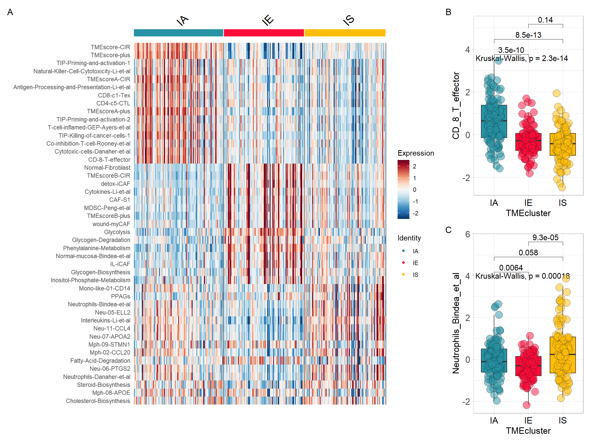
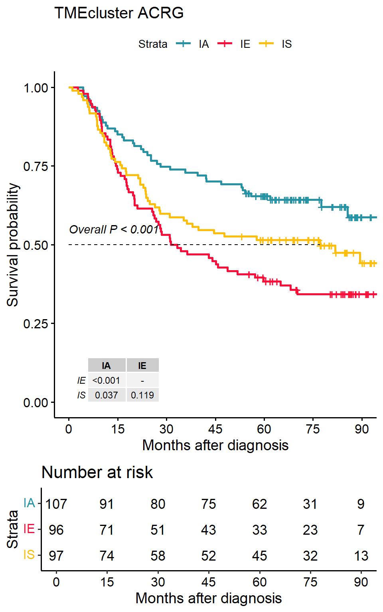

# **Tumor ecosystem analysis**

## Loading packages


```r
library(IOBR)
```

## Downloading data for example
Obtaining data set from GEO [Gastric cancer: GSE62254](https://pubmed.ncbi.nlm.nih.gov/25894828/) using `GEOquery` R package.

```r
if (!requireNamespace("GEOquery", quietly = TRUE))  BiocManager::install("GEOquery")
library("GEOquery")
# NOTE: This process may take a few minutes which depends on the internet connection speed. Please wait for its completion.
eset_geo<-getGEO(GEO     = "GSE62254", getGPL  = F, destdir = "./")
eset    <-eset_geo[[1]]
eset    <-exprs(eset)
eset[1:5,1:5]
```

```
##           GSM1523727 GSM1523728 GSM1523729 GSM1523744 GSM1523745
## 1007_s_at  3.2176645  3.0624323  3.0279131   2.921683  2.8456013
## 1053_at    2.4050109  2.4394879  2.2442708   2.345916  2.4328582
## 117_at     1.4933412  1.8067380  1.5959665   1.839822  1.8326058
## 121_at     2.1965561  2.2812181  2.1865556   2.258599  2.1874363
## 1255_g_at  0.8698382  0.9502466  0.8125414   1.012860  0.9441993
```

## Gene Annotation: HGU133PLUS-2 (Affaymetrix)

```r
# Conduct gene annotation using `anno_hug133plus2` file; If identical gene symbols exists, these genes would be ordered by the mean expression levels. The gene symbol with highest mean expression level is selected and remove others. 

eset<-anno_eset(eset       = eset,
                annotation = anno_hug133plus2,
                symbol     = "symbol",
                probe      = "probe_id",
                method     = "mean")
eset[1:5, 1:3]
```

```
##              GSM1523727 GSM1523728 GSM1523729
## SH3KBP1        4.327974   4.316195   4.351425
## RPL41          4.246149   4.246808   4.257940
## EEF1A1         4.293762   4.291038   4.262199
## COX2           4.250288   4.283714   4.270508
## LOC101928826   4.219303   4.219670   4.213252
```

## Determine TME subtype of gastric cancer using [TMEclassifier R package](https://github.com/LiaoWJLab/TMEclassifier)

```r
if (!requireNamespace("TMEclassifier", quietly = TRUE)) devtools::install_github("LiaoWJLab/TMEclassifier")
library(TMEclassifier)
tme <- tme_classifier(eset = eset, scale = TRUE)
```

```
## Step-1: Expression data preprocessing...
## Step-2: TME deconvolution...
## Step-3: Predicting TME phenotypes...
## [20:40:34] WARNING: src/learner.cc:1203: 
##   If you are loading a serialized model (like pickle in Python, RDS in R) generated by
##   older XGBoost, please export the model by calling `Booster.save_model` from that version
##   first, then load it back in current version. See:
## 
##     https://xgboost.readthedocs.io/en/latest/tutorials/saving_model.html
## 
##   for more details about differences between saving model and serializing.
## 
## [20:40:34] WARNING: src/learner.cc:888: Found JSON model saved before XGBoost 1.6, please save the model using current version again. The support for old JSON model will be discontinued in XGBoost 2.3.
## [20:40:34] WARNING: src/learner.cc:553: 
##   If you are loading a serialized model (like pickle in Python, RDS in R) generated by
##   older XGBoost, please export the model by calling `Booster.save_model` from that version
##   first, then load it back in current version. See:
## 
##     https://xgboost.readthedocs.io/en/latest/tutorials/saving_model.html
## 
##   for more details about differences between saving model and serializing.
## 
## >>>--- DONE!
```

```r
table(tme$TMEcluster)
```

```
## 
##  IA  IE  IS 
## 107  96  97
```

```r
head(tme)
```

```
##           ID          IE         IS         IA TMEcluster
## 1 GSM1523727 0.204623557 0.11212681 0.68324962         IA
## 2 GSM1523728 0.009599504 0.11179146 0.87860903         IA
## 3 GSM1523729 0.852615046 0.11369089 0.03369407         IE
## 4 GSM1523744 0.053842233 0.06994632 0.87621145         IA
## 5 GSM1523745 0.055973019 0.80839488 0.13563209         IS
## 6 GSM1523746 0.545343299 0.37437568 0.08028102         IE
```


```r
table(tme$TMEcluster)
```

```
## 
##  IA  IE  IS 
## 107  96  97
```

```r
head(tme)
```

```
##           ID          IE         IS         IA TMEcluster
## 1 GSM1523727 0.204623557 0.11212681 0.68324962         IA
## 2 GSM1523728 0.009599504 0.11179146 0.87860903         IA
## 3 GSM1523729 0.852615046 0.11369089 0.03369407         IE
## 4 GSM1523744 0.053842233 0.06994632 0.87621145         IA
## 5 GSM1523745 0.055973019 0.80839488 0.13563209         IS
## 6 GSM1523746 0.545343299 0.37437568 0.08028102         IE
```

## DEG analysis: method1
Differential analysis of selected immune-activated and immune-expelled gastric cancers


```r
pdata <- tme[!tme$TMEcluster=="IS", ]
deg  <-   iobr_deg(eset         = eset,
                   annotation    = NULL,
                   pdata        = pdata,
                   group_id     = "TMEcluster",
                   pdata_id     = "ID",
                   array        = TRUE,
                   method       = "limma",
                   contrast     = c("IA","IE"),
                   path         = "result",
                   padj_cutoff  = 0.01,
                   logfc_cutoff = 0.5)
```

```
## >>>== Matching grouping information and expression matrix
```

```
## >>>== limma was selected for differential gene analysis of Array data
```

```
## Warning: package 'limma' was built under R version 4.2.1
```

```
## 
## Attaching package: 'limma'
```

```
## The following object is masked from 'package:BiocGenerics':
## 
##     plotMA
```

```
## group1 = IE
```

```
## group2 = NA
```

```
## # A tibble: 6 × 11
##   symbol  log2FoldChange AveExpr     t   pvalue     padj     B sigORnot    label
##   <chr>            <dbl>   <dbl> <dbl>    <dbl>    <dbl> <dbl> <chr>       <chr>
## 1 TMEM100          0.774    1.84  13.9 2.47e-31 5.37e-27  60.4 Up_regulat… Both 
## 2 ABCA8            0.933    1.90  12.9 3.11e-28 3.38e-24  53.4 Up_regulat… Both 
## 3 HHIP             0.613    1.73  12.1 7.62e-26 4.46e-22  48.0 Up_regulat… Both 
## 4 LMNB2           -0.287    2.25 -12.1 9.28e-26 4.46e-22  47.8 NOT         Sign…
## 5 MCM6            -0.211    3.02 -12.1 1.02e-25 4.46e-22  47.7 NOT         Sign…
## 6 ADH1B            0.907    1.86  12.0 2.27e-25 7.04e-22  47.0 Up_regulat… Both 
## # ℹ 2 more variables: IE <dbl>, `` <dbl>
```

## GSEA analysis based on differential express gene analysis results


Select the gene set list in IOBR's signature collection.

```r
head(deg)
```

```
## # A tibble: 6 × 11
##   symbol  log2FoldChange AveExpr     t   pvalue     padj     B sigORnot    label
##   <chr>            <dbl>   <dbl> <dbl>    <dbl>    <dbl> <dbl> <chr>       <chr>
## 1 TMEM100          0.774    1.84  13.9 2.47e-31 5.37e-27  60.4 Up_regulat… Both 
## 2 ABCA8            0.933    1.90  12.9 3.11e-28 3.38e-24  53.4 Up_regulat… Both 
## 3 HHIP             0.613    1.73  12.1 7.62e-26 4.46e-22  48.0 Up_regulat… Both 
## 4 LMNB2           -0.287    2.25 -12.1 9.28e-26 4.46e-22  47.8 NOT         Sign…
## 5 MCM6            -0.211    3.02 -12.1 1.02e-25 4.46e-22  47.7 NOT         Sign…
## 6 ADH1B            0.907    1.86  12.0 2.27e-25 7.04e-22  47.0 Up_regulat… Both 
## # ℹ 2 more variables: IE <dbl>, `` <dbl>
```

```r
sig_list <- signature_collection[c("TMEscoreB_CIR", "TMEscoreA_CIR", "DNA_replication", "Base_excision_repair",
                                   "Pan_F_TBRs", "TGFb.myCAF", "Ferroptosis", "TLS_Nature", "Glycolysis")]
sig_list
```

```
## $TMEscoreB_CIR
##   [1] "DCN"          "SEPP1"        "ACTA2"        "SPARCL1"      "BEX3"        
##   [6] "MYLK"         "AKR1C1"       "TIMP2"        "MXRA7"        "C11orf96"    
##  [11] "CAV1"         "PDGFRA"       "FHL1"         "MGP"          "EID1"        
##  [16] "LOC101930400" "DST"          "GREM1"        "FERMT2"       "TNC"         
##  [21] "CYBRD1"       "LTBP1"        "ACTG2"        "TMEM47"       "SERPINE2"    
##  [26] "ANTXR2"       "GNG11"        "TAGLN"        "GSTA4"        "PKIG"        
##  [31] "MAOA"         "PTRF"         "FAM3B"        "PBX1"         "WLS"         
##  [36] "SELM"         "SVIL"         "MYH11"        "AGT"          "SPON1"       
##  [41] "TGFB1I1"      "PDLIM3"       "PDK4"         "SYNPO2"       "MSRB3"       
##  [46] "PROS1"        "EDNRA"        "AKAP12"       "PSD3"         "TNS1"        
##  [51] "JAM3"         "PDZRN3"       "DDR2"         "HMGCS2"       "SGCE"        
##  [56] "MRVI1"        "WFDC1"        "FBLN1"        "FMO5"         "MAOB"        
##  [61] "AMOTL1"       "AKT3"         "CNRIP1"       "CPE"          "MAP1B"       
##  [66] "RBP1"         "GNAI1"        "FOXF2"        "SORBS2"       "ZCCHC24"     
##  [71] "ZNF704"       "ARMCX1"       "DIXDC1"       "SSTR1"        "THRB"        
##  [76] "C3orf70"      "PKIB"         "CNN1"         "SYTL5"        "DACT1"       
##  [81] "SYNPO"        "GAS1"         "DPYSL3"       "CCDC80"       "TSPYL5"      
##  [86] "DCHS1"        "SOBP"         "AOC3"         "NDN"          "FGF7P3"      
##  [91] "SMAD9"        "MCC"          "CLMP"         "MYL9"         "RBP4"        
##  [96] "PLN"          "SPOCK1"       "COL14A1"      "CRYAB"        "SRPX"        
## [101] "EML1"         "RERG"         "PPP1R3C"      "LOC100506718" "CH25H"       
## [106] "HSPB8"        "PID1"         "TTC28"        "STON1"        "ABCG2"       
## [111] "ZSCAN18"      "SCIN"         "C14orf132"    "TMEM55A"      "WASF3"       
## [116] "PAPLN"        "COLEC12"      "ACKR1"        "TMEM150C"     "RAI2"        
## [121] "TSPAN7"       "MRGPRF"       "ABCA8"        "CHIC1"        "NBEA"        
## [126] "FAM13C"       "SETBP1"       "LDOC1"        "TMEM100"      "LOC101930349"
## [131] "PRICKLE2"     "TSPAN18"      "FABP4"        "ARHGEF26"     "ERICH5"      
## [136] "MYOCD"        "BEX2"         "PPP1R14A"     "FGF13"        "RUNX1T1"     
## [141] "MAGI2-AS3"    "LINC01279"    "REEP1"        "PLAC9"        "MYEF2"       
## [146] "PRKD1"        "RGN"          "CLDN11"       "ANK2"         "ESRRG"       
## [151] "SYNC"         "ZNF667-AS1"   "FGF7"         "SFRP1"        "HMCN1"       
## [156] "TCEAL7"       "OGN"          "MAGI2"        "MIR100HG"     "FILIP1"      
## [161] "LOC100507334" "ANKRD6"       "PLEKHH2"      "ZNF542P"      "ARMCX4"      
## [166] "NOV"          "DCLK1"        "ARHGAP28"     "C2orf40"      "TRHDE"       
## [171] "EPHA7"        "SCRG1"        "ZNF677"       "ZFPM2"        "PEG3"        
## [176] "SERP2"        "ZNF415"       "MAMDC2"       "RBM24"        "MEOX2"       
## 
## $TMEscoreA_CIR
##  [1] "HLA-DPB1"       "UBD"            "LOC100509457"   "WARS"          
##  [5] "TAP1"           "HLA-DMA"        "TRIM22"         "PSAT1"         
##  [9] "CXCL10"         "SOCS3"          "CXCL9"          "PBK"           
## [13] "CCL4"           "CCL5"           "BCL2A1"         "TRBC1"         
## [17] "IDO1"           "NFE2L3"         "CCL3L3"         "DTL"           
## [21] "MMP9"           "SLC2A3"         "ZNF367"         "RCC1"          
## [25] "STIL"           "TRAC"           "HELLS"          "GZMB"          
## [29] "RTEL1-TNFRSF6B" "CXCL11"         "GBP5"           "CD2"           
## [33] "CDCA2"          "CDT1"           "TNFAIP2"        "TYMP"          
## [37] "MICB"           "SLC2A14"        "GZMK"           "CD8A"          
## [41] "CENPH"          "MND1"           "BATF2"          "BRIP1"         
## [45] "E2F7"           "KIF18A"         "AIM2"           "ETV7"          
## [49] "ITK"            "GNLY"           "GPR171"         "WDHD1"         
## [53] "GBP4"           "MB21D1"         "NLRP3"          "MCEMP1"        
## [57] "POLR3G"         "NLRC3"          "KLRC2"          "CLEC5A"        
## [61] "ARHGAP11A"      "GPR84"          "IFNG"           "ZBED2"         
## 
## $DNA_replication
##  [1] "RNASEH2A" "POLD3"    "DNA2"     "FEN1"     "POLA2"    "RNASEH1" 
##  [7] "RPA4"     "LIG1"     "MCM2"     "MCM3"     "MCM4"     "MCM5"    
## [13] "MCM6"     "MCM7"     "PCNA"     "POLE3"    "POLA1"    "POLD1"   
## [19] "POLD2"    "POLE"     "POLE2"    "PRIM1"    "PRIM2"    "POLE4"   
## [25] "POLD4"    "RFC1"     "RFC2"     "RFC3"     "RFC4"     "RFC5"    
## [31] "RPA1"     "RPA2"     "RPA3"     "SSBP1"    "RNASEH2B" "RNASEH2C"
## 
## $Base_excision_repair
##  [1] "PARP2" "PARP3" "POLD3" "PARP1" "PARP4" "FEN1"  "SMUG1" "NEIL2" "APEX2"
## [10] "POLL"  "HMGB1" "APEX1" "LIG1"  "LIG3"  "MPG"   "MUTYH" "NTHL1" "OGG1" 
## [19] "PCNA"  "POLE3" "POLB"  "POLD1" "POLD2" "POLE"  "POLE2" "NEIL3" "POLE4"
## [28] "POLD4" "UNG"   "XRCC1" "NEIL1" "MBD4" 
## 
## $Pan_F_TBRs
##  [1] "ACTA2"    "ACTG2"    "ADAM12"   "ADAM19"   "CNN1"     "COL4A1"  
##  [7] "CTGF"     "CTPS1"    "FAM101B"  "FSTL3"    "HSPB1"    "IGFBP3"  
## [13] "PXDC1"    "SEMA7A"   "SH3PXD2A" "TAGLN"    "TGFBI"    "TNS1"    
## [19] "TPM1"    
## 
## $TGFb.myCAF
##  [1] "CST1"    "LAMP5"   "LOXL1"   "EDNRA"   "TGFB1"   "TGFB3"   "TNN"    
##  [8] "CST2"    "HES4"    "COL10A1" "ELN"     "THBS4"   "NKD2"    "OLFM2"  
## [15] "COL6A3"  "LRRC17"  "COL3A1"  "THY1"    "HTRA3"   "TMEM204" "11-Sep" 
## [22] "COMP"    "TNFAIP6" "ID4"     "GGT5"    "INAFM1"  "CILP"    "OLFML2B"
## 
## $Ferroptosis
##  [1] "ACSL4"      "AKR1C1-3"   "ALOXs"      "ATP5G3"     "CARS"      
##  [6] "CBS"        "CD44v"      "CHAC1"      "CISD1"      "CS"        
## [11] "DPP4"       "FANCD2"     "GCLC/GCLM"  "GLS2"       "GPX4"      
## [16] "GSS"        "HMGCR"      "HSPB1/5"    "KOD"        "LPCAT3"    
## [21] "MT1G"       "NCOA4"      "NFE2L2"     "PTGS2"      "RPL8"      
## [26] "SAT1"       "SLC7A11"    "SQS"        "TFRC"       "TP53"      
## [31] "TTC35/EMC2" "MESH1"     
## 
## $TLS_Nature
## [1] "CD79B"  "CD1D"   "CCR6"   "LAT"    "SKAP1"  "CETP"   "EIF1AY" "RBP5"  
## [9] "PTGDS" 
## 
## $Glycolysis
##  [1] "ACSS1"   "ACSS2"   "ADH1A"   "ADH1B"   "ADH1C"   "ADH4"    "ADH5"   
##  [8] "ADH6"    "ADH7"    "ADPGK"   "AKR1A1"  "ALDH1A3" "ALDH1B1" "ALDH2"  
## [15] "ALDH3A1" "ALDH3A2" "ALDH3B1" "ALDH3B2" "ALDH7A1" "ALDH9A1" "ALDOA"  
## [22] "ALDOB"   "ALDOC"   "BPGM"    "DLAT"    "DLD"     "ENO1"    "ENO2"   
## [29] "ENO3"    "FBP1"    "FBP2"    "G6PC"    "G6PC2"   "GALM"    "GAPDH"  
## [36] "GAPDHS"  "GCK"     "GPI"     "HK1"     "HK2"     "HK3"     "HKDC1"  
## [43] "LDHA"    "LDHAL6A" "LDHAL6B" "LDHB"    "LDHC"    "PANK1"   "PCK1"   
## [50] "PCK2"    "PDHA1"   "PDHA2"   "PDHB"    "PFKFB1"  "PFKFB2"  "PFKFB3" 
## [57] "PFKFB4"  "PFKL"    "PFKM"    "PFKP"    "PGAM1"   "PGAM2"   "PGAM4"  
## [64] "PGK1"    "PGK2"    "PGM1"    "PGM2"    "PKLR"    "PKM"     "SLC2A2" 
## [71] "TPI1"
```


```r
gsea<-     sig_gsea(deg,
                    genesets          = sig_list,
                    path              = "result",
                    gene_symbol       = "symbol",
                    logfc             = "log2FoldChange",
                    org               = "hsa",
                    show_plot         = FALSE,
                    msigdb            = TRUE,
                    category          = "H",
                    subcategory       = NULL,
                    palette_bar       = "set2")
```

<div class="figure" style="text-align: center">

<p class="caption">(\#fig:unnamed-chunk-9)GSEA of TME gent sets</p>
</div>

Hallmark gene signatures

```r
gsea<-     sig_gsea(deg,
                    genesets          = NULL,
                    path              = "GSEA",
                    gene_symbol       = "symbol",
                    logfc             = "log2FoldChange",
                    org               = "hsa",
                    show_plot         = FALSE,
                    msigdb            = TRUE,
                    category          = "H",
                    subcategory       = NULL,
                    palette_bar       = "aaas",
                    show_bar          = 5,
                    show_gsea         = 6)
```

<div class="figure" style="text-align: center">

<p class="caption">(\#fig:unnamed-chunk-11)GSEA of Hallmark gent sets</p>
</div>


## DEG analysis: method2

Identifing TME subtype-related differential genes using `find_markers_in_bulk`

```r
library(Seurat)
res <- find_markers_in_bulk(pdata      = tme, 
                            eset       = eset, 
                            group      = "TMEcluster", 
                            nfeatures  = 2000, 
                            top_n      = 50, 
                            thresh.use = 0.15, 
                            only.pos   = TRUE, 
                            min.pct    = 0.10)
```

```
## 
##  IA  IE  IS 
## 107  96  97 
## # A tibble: 150 × 7
## # Groups:   cluster [3]
##       p_val avg_log2FC pct.1 pct.2 p_val_adj cluster gene  
##       <dbl>      <dbl> <dbl> <dbl>     <dbl> <fct>   <chr> 
##  1 3.37e-22      0.410     1     1  7.34e-18 IA      TAP1  
##  2 3.29e-20      0.632     1     1  7.15e-16 IA      IFNG  
##  3 2.58e-19      0.380     1     1  5.61e-15 IA      ETV7  
##  4 3.86e-19      0.403     1     1  8.39e-15 IA      MB21D1
##  5 1.81e-18      0.671     1     1  3.93e-14 IA      CXCL10
##  6 1.93e-17      0.421     1     1  4.20e-13 IA      MND1  
##  7 3.23e-17      0.369     1     1  7.02e-13 IA      PSMB9 
##  8 7.47e-17      0.378     1     1  1.62e-12 IA      CDT1  
##  9 1.01e-16      0.655     1     1  2.20e-12 IA      GZMB  
## 10 2.82e-16      0.817     1     1  6.12e-12 IA      CXCL11
## # ℹ 140 more rows
```

```r
top15 <-  res$top_markers %>% dplyr:: group_by(cluster) %>%  dplyr::top_n(15, avg_log2FC)
top15$gene
```

```
##  [1] "IFNG"           "CXCL10"         "GZMB"           "CXCL11"        
##  [5] "CXCL9"          "WARS"           "IDO1"           "UBD"           
##  [9] "GBP4"           "GNLY"           "KLRC2"          "GZMH"          
## [13] "VSNL1"          "AIM2"           "SLCO1B3"        "ADH1B"         
## [17] "ABCA8"          "MAMDC2"         "SCN7A"          "MYH11"         
## [21] "C7"             "C2orf40"        "LIPF"           "PGA4"          
## [25] "SCRG1"          "GHRL"           "CNN1"           "OGN"           
## [29] "GIF"            "ATP4A"          "IL1A"           "EREG"          
## [33] "PPBP"           "IL11"           "PI15"           "IL24"          
## [37] "PROK2"          "HCAR3"          "RBP4"           "MAGEA10-MAGEA5"
## [41] "MAGEA4"         "MAGEA12"        "MAGEA6"         "MAGEA2B"       
## [45] "REG1B"
```

Heatmap visualisation using `Seurat`'s `DoHeatmap`

```r
#定义分型对应的颜色
cols <- c('#2692a4','#fc0d3a','#ffbe0b')
p1 <- DoHeatmap(res$sce, top15$gene, group.colors = cols )+
  scale_fill_gradientn(colours = rev(colorRampPalette(RColorBrewer::brewer.pal(11,"RdBu"))(256)))
```

Extracting variables from the expression matrix to merge with TME subtypes


```r
input <- combine_pd_eset(eset = eset, pdata = tme, feas = top15$gene, scale = T)
p2 <- sig_box(input, variable = "TMEcluster", signature = "IFNG", jitter = TRUE,
              cols =  cols, show_pvalue = TRUE, size_of_pvalue = 4)
```

```
## # A tibble: 3 × 8
##   .y.       group1 group2        p    p.adj p.format p.signif method  
##   <chr>     <chr>  <chr>     <dbl>    <dbl> <chr>    <chr>    <chr>   
## 1 signature IA     IE     4.09e-17 1.20e-16 < 2e-16  ****     Wilcoxon
## 2 signature IA     IS     1.44e-13 2.90e-13 1.4e-13  ****     Wilcoxon
## 3 signature IE     IS     8.35e- 2 8.4 e- 2 0.084    ns       Wilcoxon
```

```r
p3 <- sig_box(input, variable = "TMEcluster", signature = "IL1A", 
              jitter = TRUE, cols =  cols, show_pvalue = TRUE, size_of_pvalue = 4)
```

```
## # A tibble: 3 × 8
##   .y.       group1 group2        p    p.adj p.format p.signif method  
##   <chr>     <chr>  <chr>     <dbl>    <dbl> <chr>    <chr>    <chr>   
## 1 signature IA     IE     1.46e-10 2.90e-10 1.5e-10  ****     Wilcoxon
## 2 signature IA     IS     8.22e- 7 8.2 e- 7 8.2e-07  ****     Wilcoxon
## 3 signature IE     IS     4.90e-20 1.5 e-19 < 2e-16  ****     Wilcoxon
```


```r
if (!requireNamespace("patchwork", quietly = TRUE))   install.packages("patchwork")
library(patchwork)
p <- (p1|p2/p3) + plot_layout(widths = c(2.3,1))
p + plot_annotation(tag_levels = 'A')
```


## Identifying signatures associated with TME clusters

Calculate TME associated signatures-(through PCA method).

```r
sig_tme<-calculate_sig_score(pdata           = NULL,
                             eset            = eset,
                             signature       = signature_collection,
                             method          = "pca",
                             mini_gene_count = 2)
sig_tme <- t(column_to_rownames(sig_tme, var = "ID"))
sig_tme[1:5, 1:3]
```

```
##                   GSM1523727 GSM1523728 GSM1523729
## CD_8_T_effector   -2.5513794  0.7789141 -2.1770675
## DDR               -0.8747614  0.7425162 -1.3272054
## APM                1.1098368  2.1988688 -0.9516419
## Immune_Checkpoint -2.3701787  0.9455120 -1.4844104
## CellCycle_Reg      0.1063358  0.7583302 -0.3649795
```

Finding signatures or cell types associated with TMEcluster

```r
res <- find_markers_in_bulk(pdata = tme, eset = sig_tme, group = "TMEcluster", nfeatures = 1000, top_n = 20, min.pct = 0.10)
```

```
## 
##  IA  IE  IS 
## 107  96  97 
## # A tibble: 60 × 7
## # Groups:   cluster [3]
##       p_val avg_log2FC pct.1 pct.2 p_val_adj cluster gene                       
##       <dbl>      <dbl> <dbl> <dbl>     <dbl> <fct>   <chr>                      
##  1 4.10e-31      11.6  0.907 0.29   1.05e-28 IA      TMEscore-plus              
##  2 1.05e-27      21.4  0.907 0.368  2.69e-25 IA      TMEscore-CIR               
##  3 2.83e-23       7.30 0.757 0.254  7.24e-21 IA      TMEscoreA-plus             
##  4 1.98e-17       8.88 0.701 0.316  5.07e-15 IA      TMEscoreA-CIR              
##  5 4.95e-15       5.30 0.673 0.275  1.27e-12 IA      CD-8-T-effector            
##  6 7.70e-15       3.67 0.71  0.332  1.97e-12 IA      Th1-cells-Bindea-et-al     
##  7 9.76e-11       5.39 0.673 0.342  2.50e- 8 IA      Cytotoxic-cells-Danaher-et…
##  8 8.78e-10       4.17 0.682 0.394  2.25e- 7 IA      NK-CD56dim-cells-Bindea-et…
##  9 3.27e- 9       8.11 0.673 0.415  8.36e- 7 IA      Antigen-Processing-and-Pre…
## 10 5.40e- 9       6.37 0.645 0.409  1.38e- 6 IA      T-cell-inflamed-GEP-Ayers-…
## # ℹ 50 more rows
```

```r
top15 <-  res$top_markers %>% dplyr:: group_by(cluster) %>%  dplyr::top_n(15, avg_log2FC)

p1 <- DoHeatmap(res$sce, top15$gene, group.colors = cols)+
  scale_fill_gradientn(colours = rev(colorRampPalette(RColorBrewer::brewer.pal(11,"RdBu"))(256)))
```


```r
top15$gene  <- gsub(top15$gene, pattern = "-", replacement = "\\_")
input <- combine_pd_eset(eset = sig_tme, pdata = tme, feas = top15$gene, scale = T)

p2 <- sig_box(input, variable = "TMEcluster", signature = "CD_8_T_effector", jitter = TRUE,
              cols =  cols, show_pvalue = TRUE, size_of_pvalue = 4, size_of_font = 6)
```

```
## # A tibble: 3 × 8
##   .y.       group1 group2        p    p.adj p.format p.signif method  
##   <chr>     <chr>  <chr>     <dbl>    <dbl> <chr>    <chr>    <chr>   
## 1 signature IA     IE     3.53e-10 7.10e-10 3.5e-10  ****     Wilcoxon
## 2 signature IA     IS     8.49e-13 2.5 e-12 8.5e-13  ****     Wilcoxon
## 3 signature IE     IS     1.41e- 1 1.4 e- 1 0.14     ns       Wilcoxon
```

```r
p3 <- sig_box(input, variable = "TMEcluster", signature = "Neutrophils_Bindea_et_al",  
              jitter = TRUE, cols =  cols, show_pvalue = TRUE, size_of_pvalue = 4, size_of_font = 6)
```

```
## # A tibble: 3 × 8
##   .y.       group1 group2         p   p.adj p.format p.signif method  
##   <chr>     <chr>  <chr>      <dbl>   <dbl> <chr>    <chr>    <chr>   
## 1 signature IA     IE     0.00639   0.013   0.0064   **       Wilcoxon
## 2 signature IA     IS     0.0584    0.058   0.0584   ns       Wilcoxon
## 3 signature IE     IS     0.0000929 0.00028 9.3e-05  ****     Wilcoxon
```


```r
p <- (p1|p2/p3) + plot_layout(widths = c(2.3,1))
p + plot_annotation(tag_levels = 'A')
```




```r
library(survminer)
data(pdata_acrg, package = "IOBR")
input <- merge(pdata_acrg, input, by = "ID")
p1<-surv_group(input_pdata       = input,
               target_group      = "TMEcluster",
               ID                = "ID",
               reference_group   = "High",
               project           = "ACRG",
               cols              = cols, 
               time              = "OS_time",
               status            = "OS_status",
               time_type         = "month",
               save_path         = "result")
```

```
## >>> Dataset's survival follow up time is range between 1 to 105.7 months
```

```
##  IA  IE  IS 
## 107  96  97
```

```
## 1079697
```

```
##   Maximum of follow up time is 105.7 months; and will be divided into 6 sections;
```

```r
p1
```




```r
p1<- percent_bar_plot(input, x = "TMEcluster" , y = "Subtype", palette = "jama")
```

```
## # A tibble: 12 × 5
## # Groups:   TMEcluster [3]
##    TMEcluster Subtype    Freq  Prop count
##    <chr>      <fct>     <dbl> <dbl> <dbl>
##  1 IA         EMT           7  0.07   107
##  2 IA         MSI          49  0.46   107
##  3 IA         MSS/TP53-    27  0.25   107
##  4 IA         MSS/TP53+    24  0.22   107
##  5 IE         EMT          24  0.25    96
##  6 IE         MSI           3  0.03    96
##  7 IE         MSS/TP53-    40  0.42    96
##  8 IE         MSS/TP53+    29  0.3     96
##  9 IS         EMT          15  0.15    97
## 10 IS         MSI          16  0.16    97
## 11 IS         MSS/TP53-    40  0.41    97
## 12 IS         MSS/TP53+    26  0.27    97
## [1] "'#374E55FF', '#DF8F44FF', '#00A1D5FF', '#B24745FF', '#79AF97FF', '#6A6599FF', '#80796BFF'"
```

```r
p2<- percent_bar_plot(input, x = "TMEcluster" , y = "Lauren", palette = "jama")
```

```
## # A tibble: 9 × 5
## # Groups:   TMEcluster [3]
##   TMEcluster Lauren      Freq  Prop count
##   <chr>      <fct>      <dbl> <dbl> <dbl>
## 1 IA         Diffuse       34  0.32   107
## 2 IA         Intestinal    60  0.56   107
## 3 IA         Mixed         13  0.12   107
## 4 IE         Diffuse       60  0.62    96
## 5 IE         Intestinal    32  0.33    96
## 6 IE         Mixed          4  0.04    96
## 7 IS         Diffuse       41  0.42    97
## 8 IS         Intestinal    54  0.56    97
## 9 IS         Mixed          2  0.02    97
## [1] "'#374E55FF', '#DF8F44FF', '#00A1D5FF', '#B24745FF', '#79AF97FF', '#6A6599FF', '#80796BFF'"
```

```r
p3<- percent_bar_plot(input, x = "TMEcluster" , y = "TMEscore_binary", palette = "jama")
```

```
## # A tibble: 7 × 5
## # Groups:   TMEcluster [3]
##   TMEcluster TMEscore_binary  Freq  Prop count
##   <chr>      <fct>           <dbl> <dbl> <dbl>
## 1 IA         High               60  0.56   107
## 2 IA         Low                47  0.44   107
## 3 IE         High                5  0.05    96
## 4 IE         Low                91  0.95    96
## 5 IS         High                6  0.06    97
## 6 IS         Low                90  0.93    97
## 7 IS         <NA>                1  0.01    97
## [1] "'#374E55FF', '#DF8F44FF', '#00A1D5FF', '#B24745FF', '#79AF97FF', '#6A6599FF', '#80796BFF'"
```


```r
p1|p2|p3
```


## References

Cristescu, R., Lee, J., Nebozhyn, M. et al. Molecular analysis of gastric cancer identifies subtypes associated with distinct clinical outcomes. Nat Med 21, 449–456 (2015). https://doi.org/10.1038/nm.3850

[CIBERSORT](https://cibersort.stanford.edu/); Newman, A. M., Liu, C. L., Green, M. R., Gentles, A. J., Feng, W., Xu, Y., … Alizadeh, A. A. (2015). Robust enumeration of cell subsets from tissue expression profiles. Nature Methods, 12(5), 453–457.  https://doi.org/10.1038/nmeth.3337; 

Seurat: Hao and Hao et al. Integrated analysis of multimodal single-cell data. Cell (2021)

Zeng D, Yu Y, Qiu W, Mao Q, …, Zhang K, Liao W; Tumor microenvironment immunotyping heterogeneity reveals distinct molecular mechanisms to clinical immunotherapy applications in gastric cancer. (2023) Under Review.
