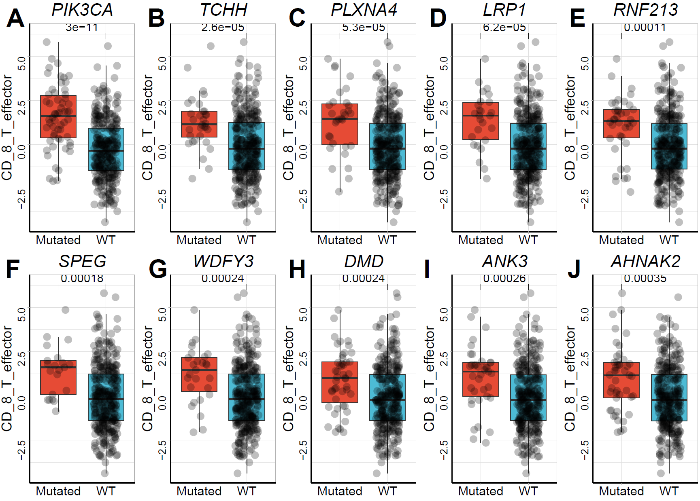

# **TME and genomic interaction**

## Loading packages


```r
library(IOBR)
```

## Genomic data prepare

MAF data was download from [UCSC Xena hub](https://xenabrowser.net/datapages/)
In this example, we used the maf file of TCGA-STAD to extract the SNPs in it,and then transformed it into a non-negative matrix.

```r
maf_file <-"./TCGA.STAD.mutect.c06465a3-50e7-46f7-b2dd-7bd654ca206b.DR-10.0.somatic.maf"
mut_list <- make_mut_matrix(maf = maf_file, isTCGA   = T, category = "multi")
```

```
## -Reading
## -Validating
## -Silent variants: 70967 
## -Summarizing
## --Possible FLAGS among top ten genes:
##   TTN
##   MUC16
##   SYNE1
##   FLG
## -Processing clinical data
## --Missing clinical data
## -Finished in 13.1s elapsed (13.0s cpu) 
##        Frame_Shift_Del        Frame_Shift_Ins           In_Frame_Del 
##                  18418                   4461                    692 
##           In_Frame_Ins      Missense_Mutation      Nonsense_Mutation 
##                    268                 109669                   6011 
##       Nonstop_Mutation            Splice_Site Translation_Start_Site 
##                    107                   2445                    106 
##    DEL    INS    SNP 
##  19387   4900 117890
```

```r
mut <- mut_list$snp
```

## Identifying Mutations Associated with TME
The microenvironmental data from the TCGA-STAD expression matrix was merged. The Cuzick or Wilcoxon test was used to identify genetic variants associated with microenvironmental factors. CD_8_T_effector was used as the target variable in this example.

```r
data("tcga_stad_sig", package = "IOBR")
res<-find_mutations(mutation_matrix     = mut, 
                    signature_matrix    = tcga_stad_sig, 
                    id_signature_matrix = "ID", 
                    signature           = "CD_8_T_effector",
                    min_mut_freq        = 0.01, 
                    plot                = TRUE, 
                    jitter              = TRUE, 
                    point.alpha         = 0.25)
```

```
## [1] ">>>> Result of Cuzick Test"
##             p.value  names statistic adjust_pvalue
## PIK3CA 3.148160e-09 PIK3CA  5.923680  1.574080e-06
## SPEG   9.070928e-05   SPEG  3.914187  2.267732e-02
## TCHH   4.409469e-04   TCHH  3.514281  5.740100e-02
## PLXNA4 5.420662e-04 PLXNA4  3.459059  5.740100e-02
## ARID1A 5.805905e-04 ARID1A  3.440523  5.740100e-02
## WDFY3  6.888120e-04  WDFY3  3.393994  5.740100e-02
## GTF3C1 8.120095e-04 GTF3C1  3.348668  5.800068e-02
## DMD    1.675467e-03    DMD  3.142439  6.972915e-02
## CR1    1.775997e-03    CR1  3.125340  6.972915e-02
## EP300  2.042083e-03  EP300  3.084043  6.972915e-02
```

```
## [1] ">>> Result of Wilcoxon test (top 10)"
##             p.value  names statistic adjust_pvalue
## PIK3CA 1.921035e-10 PIK3CA      4125  9.605174e-08
## TCHH   1.961642e-05   TCHH      3312  4.904106e-03
## SPEG   3.532750e-05   SPEG      1947  5.887916e-03
## LRP1   7.511741e-05   LRP1      2649  9.389676e-03
## WDFY3  1.257659e-04  WDFY3      2964  1.257659e-02
## ARID1A 2.468609e-04 ARID1A      4878  2.057174e-02
## PLXNA4 4.215809e-04 PLXNA4      3638  3.011292e-02
## ANK3   6.399572e-04   ANK3      4446  3.933979e-02
## DMD    7.364591e-04    DMD      5311  3.933979e-02
## PLEC   8.026240e-04   PLEC      5562  3.933979e-02
```

```
## All mutation types: mut.
```

```
## Warning: You defined `cell_fun` for a heatmap with more than 100 rows or
## columns, which might be very slow to draw. Consider to use the
## vectorized version `layer_fun`.
```

```
## All mutation types: mut.
```

```
## Warning: You defined `cell_fun` for a heatmap with more than 100 rows or
## columns, which might be very slow to draw. Consider to use the
## vectorized version `layer_fun`.
```

## OncoPrint of result
<div class="figure" style="text-align: center">

<p class="caption">(\#fig:unnamed-chunk-4)OncoPrint</p>
</div>

## Boxplot of top 10 mutated genes
<div class="figure" style="text-align: center">

<p class="caption">(\#fig:unnamed-chunk-5)Top 10 mutated genes</p>
</div>


## References

Gu, Z. (2022) Complex Heatmap Visualization. iMeta.

Anand Mayakonda et al., (2018) Maftools: efficient and comprehensive analysis of somatic variants in cancer. Genome Research
