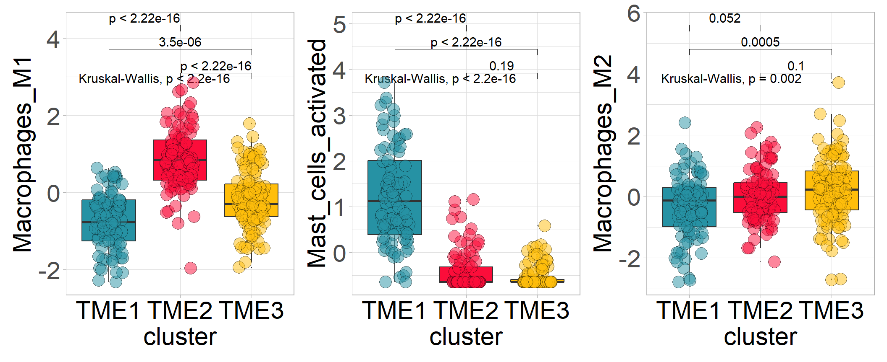
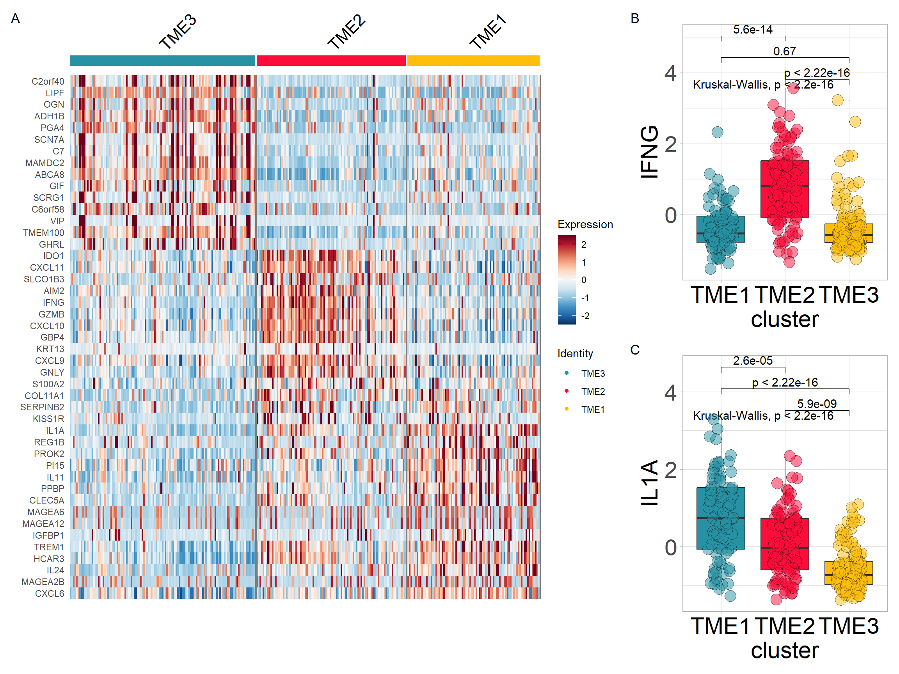
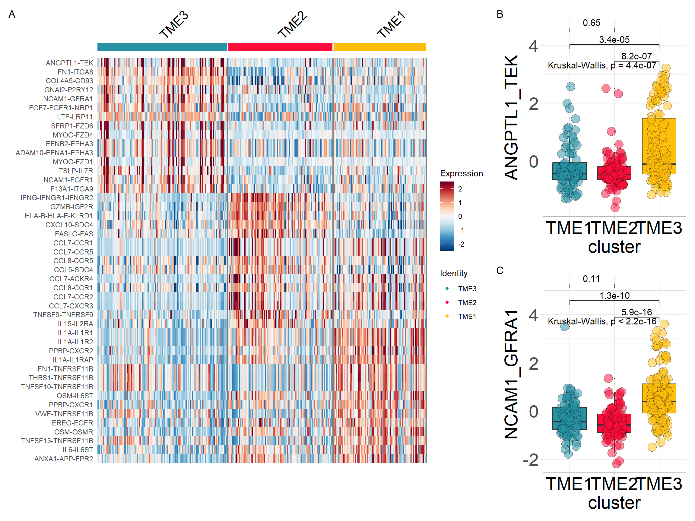

# **TME Interaction analysis**

## Loading packages


```r
library(IOBR)
```

## Downloading data for example
Obtaining data set from GEO [Gastric cancer: GSE62254](https://pubmed.ncbi.nlm.nih.gov/25894828/) using `GEOquery` R package.

```r
if (!requireNamespace("GEOquery", quietly = TRUE))  BiocManager::install("GEOquery")
library("GEOquery")
# NOTE: This process may take a few minutes which depends on the internet connection speed. Please wait for its completion.
eset_geo<- getGEO(GEO     = "GSE62254", getGPL  = F, destdir = "./")
eset    <- eset_geo[[1]]
eset    <- exprs(eset)
eset[1:5,1:5]
```

```
##           GSM1523727 GSM1523728 GSM1523729 GSM1523744 GSM1523745
## 1007_s_at  3.2176645  3.0624323  3.0279131   2.921683  2.8456013
## 1053_at    2.4050109  2.4394879  2.2442708   2.345916  2.4328582
## 117_at     1.4933412  1.8067380  1.5959665   1.839822  1.8326058
## 121_at     2.1965561  2.2812181  2.1865556   2.258599  2.1874363
## 1255_g_at  0.8698382  0.9502466  0.8125414   1.012860  0.9441993
```

## Gene Annotation: HGU133PLUS-2 (Affaymetrix)

```r
# Conduct gene annotation using `anno_hug133plus2` file; If identical gene symbols exists, these genes would be ordered by the mean expression levels. The gene symbol with highest mean expression level is selected and remove others. 

eset<-anno_eset(eset       = eset,
                annotation = anno_hug133plus2,
                symbol     = "symbol",
                probe      = "probe_id",
                method     = "mean")
eset[1:5, 1:3]
```

```
##              GSM1523727 GSM1523728 GSM1523729
## SH3KBP1        4.327974   4.316195   4.351425
## RPL41          4.246149   4.246808   4.257940
## EEF1A1         4.293762   4.291038   4.262199
## COX2           4.250288   4.283714   4.270508
## LOC101928826   4.219303   4.219670   4.213252
```

## TME deconvolution using CIBERSORT algorithm

```r
cell <- deconvo_tme(eset = eset, method = "cibersort", arrays = TRUE, perm = 1000, absolute.mode = TRUE)
head(cell)
```

```
## # A tibble: 6 × 27
##   ID        B_cells_naive_CIBERS…¹ B_cells_memory_CIBER…² Plasma_cells_CIBERSORT
##   <chr>                      <dbl>                  <dbl>                  <dbl>
## 1 GSM15237…                0.00610                0.0136                  0.149 
## 2 GSM15237…                0                      0.0339                  0.0765
## 3 GSM15237…                0.00335                0.0183                  0.0939
## 4 GSM15237…                0                      0.0594                  0.0773
## 5 GSM15237…                0                      0.00738                 0.109 
## 6 GSM15237…                0.0118                 0.0115                  0.138 
## # ℹ abbreviated names: ¹​B_cells_naive_CIBERSORT, ²​B_cells_memory_CIBERSORT
## # ℹ 23 more variables: T_cells_CD8_CIBERSORT <dbl>,
## #   T_cells_CD4_naive_CIBERSORT <dbl>,
## #   T_cells_CD4_memory_resting_CIBERSORT <dbl>,
## #   T_cells_CD4_memory_activated_CIBERSORT <dbl>,
## #   T_cells_follicular_helper_CIBERSORT <dbl>,
## #   `T_cells_regulatory_(Tregs)_CIBERSORT` <dbl>, …
```
## Identifying TME patterns
Identification of optimal clustering based on cellular infiltration patterns in the microenvironment.


```r
tme <- tme_cluster(input = cell, features = colnames(cell)[2:23], id = "ID", scale = TRUE, method = "kmeans", max.nc = 5)
```

```
## [1] ">>>== Best number of TME clusters is: "
## Number_clusters     Value_Index 
##          3.0000          2.7266 
## [1] ">>>== Cluster of samples: "
## TME1 TME2 TME3 
##   85   96  119
```

Use of heatmaps to reflect cellular differences between TME subtypes

```r
colnames(tme) <- gsub(colnames(tme), pattern = "_CIBERSORT", replacement = "")
res <- sig_heatmap(input = tme, features = colnames(tme)[3:ncol(tme)], group = "cluster", path = "result", palette = 6)
```


## Cell abundance of each cluster


```r
cols <- c('#2692a4','#fc0d3a','#ffbe0b')
p1 <- sig_box(tme, variable = "cluster", signature = "Macrophages_M1", jitter = TRUE,
              cols =  cols, show_pvalue = TRUE, size_of_pvalue = 4)
```

```
## # A tibble: 3 × 8
##   .y.       group1 group2        p    p.adj p.format p.signif method  
##   <chr>     <chr>  <chr>     <dbl>    <dbl> <chr>    <chr>    <chr>   
## 1 signature TME3   TME2   2.25e-17 4.50e-17 < 2e-16  ****     Wilcoxon
## 2 signature TME3   TME1   3.48e- 6 3.5 e- 6 3.5e-06  ****     Wilcoxon
## 3 signature TME2   TME1   6.50e-24 2   e-23 < 2e-16  ****     Wilcoxon
```

```r
p2 <- sig_box(tme, variable = "cluster", signature = "Mast_cells_activated", 
              jitter = TRUE, cols =  cols, show_pvalue = TRUE, size_of_pvalue = 4)
```

```
## # A tibble: 3 × 8
##   .y.       group1 group2        p    p.adj p.format p.signif method  
##   <chr>     <chr>  <chr>     <dbl>    <dbl> <chr>    <chr>    <chr>   
## 1 signature TME3   TME2   1.89e- 1 1.9 e- 1 0.19     ns       Wilcoxon
## 2 signature TME3   TME1   6.89e-33 2.10e-32 <2e-16   ****     Wilcoxon
## 3 signature TME2   TME1   1.12e-25 2.20e-25 <2e-16   ****     Wilcoxon
```

```r
p3 <- sig_box(tme, variable = "cluster", signature = "Macrophages_M2", 
              jitter = TRUE, cols =  cols, show_pvalue = TRUE, size_of_pvalue = 4)
```

```
## # A tibble: 3 × 8
##   .y.       group1 group2        p  p.adj p.format p.signif method  
##   <chr>     <chr>  <chr>     <dbl>  <dbl> <chr>    <chr>    <chr>   
## 1 signature TME3   TME2   0.101    0.1    0.10063  ns       Wilcoxon
## 2 signature TME3   TME1   0.000513 0.0015 0.00051  ***      Wilcoxon
## 3 signature TME2   TME1   0.0520   0.1    0.05203  ns       Wilcoxon
```


```r
p1|p2|p3
```



## DEG analysis between TME subtypes

Identifing TME subtype-related differential genes using `find_markers_in_bulk`.

We have developed a reliable classifier for the tumour microenvironment in gastric cancer using the same analysis pipeline[TMEclassifier](https://github.com/LiaoWJLab/TMEclassifier). The classifier was constructed by identifying the most robust gastric cancer TME classification through parsing the tumour microenvironment using the `tme_cluster` method. Next, genes specifically expressed by each microenvironmental subtype are obtained using the `find_markers_in_bulk method`. Finally, a machine learning approach was used to construct the classifier model.


```r
library(Seurat)
res <- find_markers_in_bulk(pdata      = tme, 
                            eset       = eset, 
                            group      = "cluster", 
                            nfeatures  = 2000, 
                            top_n      = 50, 
                            thresh.use = 0.15, 
                            only.pos   = TRUE, 
                            min.pct    = 0.10)
```

```
## 
## TME3 TME2 TME1 
##  119   96   85 
## # A tibble: 150 × 7
## # Groups:   cluster [3]
##       p_val avg_log2FC pct.1 pct.2 p_val_adj cluster gene    
##       <dbl>      <dbl> <dbl> <dbl>     <dbl> <fct>   <chr>   
##  1 3.05e-22      0.896     1     1  6.63e-18 TME3    TMEM100 
##  2 7.92e-22      1.13      1     1  1.72e-17 TME3    ADH1B   
##  3 1.61e-20      0.691     1     1  3.51e-16 TME3    HHIP    
##  4 1.93e-20      0.985     1     1  4.19e-16 TME3    ABCA8   
##  5 5.73e-20      0.701     1     1  1.25e-15 TME3    FCER1A  
##  6 9.42e-19      0.927     1     1  2.05e-14 TME3    MAMDC2  
##  7 1.61e-18      0.773     1     1  3.49e-14 TME3    C1QTNF7 
##  8 1.77e-18      0.718     1     1  3.85e-14 TME3    C16orf89
##  9 3.91e-18      0.729     1     1  8.51e-14 TME3    FHL1    
## 10 5.87e-18      0.684     1     1  1.28e-13 TME3    ITGA8   
## # ℹ 140 more rows
```

```r
top15 <-  res$top_markers %>% dplyr:: group_by(cluster) %>%  dplyr::top_n(15, avg_log2FC)
top15$gene
```

```
##  [1] "TMEM100"        "ADH1B"          "ABCA8"          "MAMDC2"        
##  [5] "SCN7A"          "LIPF"           "C7"             "C2orf40"       
##  [9] "PGA4"           "OGN"            "GKN2"           "GHRL"          
## [13] "C6orf58"        "SCRG1"          "GIF"            "IFNG"          
## [17] "WARS"           "CXCL10"         "IDO1"           "GZMB"          
## [21] "CXCL11"         "GBP4"           "CXCL9"          "GNLY"          
## [25] "GBP5"           "AIM2"           "RTEL1-TNFRSF6B" "COL11A1"       
## [29] "S100A2"         "SLCO1B3"        "IL1A"           "IL1B"          
## [33] "PPBP"           "IL11"           "CXCL6"          "CCL3L3"        
## [37] "TREM1"          "PROK2"          "IL24"           "PI15"          
## [41] "HCAR3"          "CLEC5A"         "MAGEA6"         "MAGEA12"       
## [45] "REG1B"
```

Heatmap visualisation using `Seurat`'s `DoHeatmap`

```r
#定义分型对应的颜色
cols <- c('#2692a4','#fc0d3a','#ffbe0b')
p1 <- DoHeatmap(res$sce, top15$gene, group.colors = cols )+
  scale_fill_gradientn(colours = rev(colorRampPalette(RColorBrewer::brewer.pal(11,"RdBu"))(256)))
```

Extracting variables from the expression matrix to merge with TME subtype

```r
input <- combine_pd_eset(eset = eset, pdata = tme, feas = top15$gene, scale = T)
p2 <- sig_box(input, variable = "cluster", signature = "IFNG", jitter = TRUE,
              cols =  cols, show_pvalue = TRUE, size_of_pvalue = 4)
```

```
## # A tibble: 3 × 8
##   .y.       group1 group2        p    p.adj p.format p.signif method  
##   <chr>     <chr>  <chr>     <dbl>    <dbl> <chr>    <chr>    <chr>   
## 1 signature TME3   TME2   1.11e-16 3.30e-16 < 2e-16  ****     Wilcoxon
## 2 signature TME3   TME1   6.70e- 1 6.7 e- 1 0.67     ns       Wilcoxon
## 3 signature TME2   TME1   5.60e-14 1.10e-13 5.6e-14  ****     Wilcoxon
```

```r
p3 <- sig_box(input, variable = "cluster", signature = "IL1A", 
              jitter = TRUE, cols =  cols, show_pvalue = TRUE, size_of_pvalue = 4)
```

```
## # A tibble: 3 × 8
##   .y.       group1 group2        p    p.adj p.format p.signif method  
##   <chr>     <chr>  <chr>     <dbl>    <dbl> <chr>    <chr>    <chr>   
## 1 signature TME3   TME2   5.94e- 9 1.20e- 8 5.9e-09  ****     Wilcoxon
## 2 signature TME3   TME1   7.96e-18 2.40e-17 < 2e-16  ****     Wilcoxon
## 3 signature TME2   TME1   2.60e- 5 2.6 e- 5 2.6e-05  ****     Wilcoxon
```

Combining the results obtained above

```r
# if (!requireNamespace("patchwork", quietly = TRUE))   install.packages("patchwork")
library(patchwork)
p <- (p1|p2/p3) + plot_layout(widths = c(2.3,1))
p + plot_annotation(tag_levels = 'A')
```




## Identifying signatures associated with TME clusters

Calculate TME associated signatures-(through PCA method).

```r
sig_tme<-calculate_sig_score(pdata           = NULL,
                             eset            = eset,
                             signature       = signature_collection,
                             method          = "pca",
                             mini_gene_count = 2)
sig_tme <- t(column_to_rownames(sig_tme, var = "ID"))
sig_tme[1:5, 1:3]
```

```
##                   GSM1523727 GSM1523728 GSM1523729
## CD_8_T_effector   -2.5513794  0.7789141 -2.1770675
## DDR               -0.8747614  0.7425162 -1.3272054
## APM                1.1098368  2.1988688 -0.9516419
## Immune_Checkpoint -2.3701787  0.9455120 -1.4844104
## CellCycle_Reg      0.1063358  0.7583302 -0.3649795
```

Finding characteristic variables associated with TME clusters

```r
res <- find_markers_in_bulk(pdata = tme, eset = sig_tme, group = "cluster", nfeatures = 1000, top_n = 20, min.pct = 0.10)
```

```
## 
## TME3 TME2 TME1 
##  119   96   85 
## # A tibble: 59 × 7
## # Groups:   cluster [3]
##       p_val avg_log2FC pct.1 pct.2 p_val_adj cluster gene                       
##       <dbl>      <dbl> <dbl> <dbl>     <dbl> <fct>   <chr>                      
##  1 1.05e-25       5.03 0.832 0.287  2.70e-23 TME3    Glycolysis                 
##  2 1.15e-23       3.76 0.79  0.238  2.93e-21 TME3    Tyrosine-Metabolism        
##  3 8.38e-18       4.07 0.756 0.32   2.15e-15 TME3    Drug-Metabolism-by-Cytochr…
##  4 8.59e-14       4.10 0.689 0.359  2.20e-11 TME3    Retinol-Metabolism         
##  5 2.59e-13       3.55 0.723 0.348  6.64e-11 TME3    Metabolism-of-Xenobiotics-…
##  6 5.99e-11      10.0  0.546 0.227  1.53e- 8 TME3    detox.iCAF                 
##  7 7.25e-11      10.6  0.571 0.26   1.86e- 8 TME3    Normal.Fibroblast          
##  8 2.32e-10       3.71 0.664 0.343  5.94e- 8 TME3    Ether-Lipid-Metabolism     
##  9 1.99e- 9       5.12 0.555 0.276  5.10e- 7 TME3    TMEscoreB-CIR              
## 10 2.23e- 8       3.43 0.664 0.387  5.71e- 6 TME3    Drug-Metabolism-by-other-e…
## # ℹ 49 more rows
```

```r
top15 <-  res$top_markers %>% dplyr:: group_by(cluster) %>%  dplyr::top_n(15, avg_log2FC)

p1 <- DoHeatmap(res$sce, top15$gene, group.colors = cols)+
  scale_fill_gradientn(colours = rev(colorRampPalette(RColorBrewer::brewer.pal(11,"RdBu"))(256)))
```

可视化结果：选择特征变量

```r
top15$gene  <- gsub(top15$gene, pattern = "-", replacement = "\\_")
input <- combine_pd_eset(eset = sig_tme, pdata = tme, feas = top15$gene, scale = T)

p2 <- sig_box(input, variable = "cluster", signature = "CD_8_T_effector", jitter = TRUE,
              cols =  cols, show_pvalue = TRUE, size_of_pvalue = 4, size_of_font = 6)
```

```
## # A tibble: 3 × 8
##   .y.       group1 group2        p    p.adj p.format p.signif method  
##   <chr>     <chr>  <chr>     <dbl>    <dbl> <chr>    <chr>    <chr>   
## 1 signature TME3   TME2   3.18e-12 6.40e-12 3.2e-12  ****     Wilcoxon
## 2 signature TME3   TME1   1.01e- 1 1   e- 1 0.1      ns       Wilcoxon
## 3 signature TME2   TME1   4.53e-13 1.4 e-12 4.5e-13  ****     Wilcoxon
```

```r
p3 <- sig_box(input, variable = "cluster", signature = "Neutrophils_Bindea_et_al",  
              jitter = TRUE, cols =  cols, show_pvalue = TRUE, size_of_pvalue = 4, size_of_font = 6)
```

```
## # A tibble: 3 × 8
##   .y.       group1 group2         p    p.adj p.format p.signif method  
##   <chr>     <chr>  <chr>      <dbl>    <dbl> <chr>    <chr>    <chr>   
## 1 signature TME3   TME2   0.0000416 0.000097 4.2e-05  ****     Wilcoxon
## 2 signature TME3   TME1   0.0000323 0.000097 3.2e-05  ****     Wilcoxon
## 3 signature TME2   TME1   0.149     0.15     0.15     ns       Wilcoxon
```


```r
p <- (p1|p2/p3) + plot_layout(widths = c(2.3,1))
p + plot_annotation(tag_levels = 'A')
```


Survival differences between tumour microenvironment subtypes


```r
library(survminer)
data(pdata_acrg, package = "IOBR")
input <- merge(pdata_acrg, input, by = "ID")
p1<-surv_group(input_pdata       = input,
               target_group      = "cluster",
               ID                = "ID",
               reference_group   = "High",
               project           = "ACRG",
               cols              = cols, 
               time              = "OS_time",
               status            = "OS_status",
               time_type         = "month",
               save_path         = "result")
```

```
## >>> Dataset's survival follow up time is range between 1 to 105.7 months
```

```
## TME1 TME2 TME3 
##   85   96  119
```

```
## 8596119
```

```
##   Maximum of follow up time is 105.7 months; and will be divided into 6 sections;
```

```r
p1
```



Relationship between tumour microenvironmental subtypes and other subtypes


```r
p1<- percent_bar_plot(input, x = "cluster" , y = "Subtype", palette = "jama", axis_angle = 60)
```

```
## # A tibble: 12 × 5
## # Groups:   cluster [3]
##    cluster Subtype    Freq  Prop count
##    <chr>   <fct>     <dbl> <dbl> <dbl>
##  1 TME1    EMT          14  0.16    85
##  2 TME1    MSI          12  0.14    85
##  3 TME1    MSS/TP53-    34  0.4     85
##  4 TME1    MSS/TP53+    25  0.29    85
##  5 TME2    EMT           6  0.06    96
##  6 TME2    MSI          47  0.49    96
##  7 TME2    MSS/TP53-    22  0.23    96
##  8 TME2    MSS/TP53+    21  0.22    96
##  9 TME3    EMT          26  0.22   119
## 10 TME3    MSI           9  0.08   119
## 11 TME3    MSS/TP53-    51  0.43   119
## 12 TME3    MSS/TP53+    33  0.28   119
## [1] "'#374E55FF', '#DF8F44FF', '#00A1D5FF', '#B24745FF', '#79AF97FF', '#6A6599FF', '#80796BFF'"
```

```r
p2<- percent_bar_plot(input, x = "cluster" , y = "Lauren", palette = "jama", axis_angle = 60)
```

```
## # A tibble: 9 × 5
## # Groups:   cluster [3]
##   cluster Lauren      Freq  Prop count
##   <chr>   <fct>      <dbl> <dbl> <dbl>
## 1 TME1    Diffuse       37  0.44    85
## 2 TME1    Intestinal    47  0.55    85
## 3 TME1    Mixed          1  0.01    85
## 4 TME2    Diffuse       31  0.32    96
## 5 TME2    Intestinal    54  0.56    96
## 6 TME2    Mixed         11  0.11    96
## 7 TME3    Diffuse       67  0.56   119
## 8 TME3    Intestinal    45  0.38   119
## 9 TME3    Mixed          7  0.06   119
## [1] "'#374E55FF', '#DF8F44FF', '#00A1D5FF', '#B24745FF', '#79AF97FF', '#6A6599FF', '#80796BFF'"
```

```r
p3<- percent_bar_plot(input, x = "cluster" , y = "TMEscore_binary", palette = "jama", axis_angle = 60)
```

```
## # A tibble: 7 × 5
## # Groups:   cluster [3]
##   cluster TMEscore_binary  Freq  Prop count
##   <chr>   <fct>           <dbl> <dbl> <dbl>
## 1 TME1    High                5  0.06    85
## 2 TME1    Low                79  0.93    85
## 3 TME1    <NA>                1  0.01    85
## 4 TME2    High               59  0.61    96
## 5 TME2    Low                37  0.39    96
## 6 TME3    High                7  0.06   119
## 7 TME3    Low               112  0.94   119
## [1] "'#374E55FF', '#DF8F44FF', '#00A1D5FF', '#B24745FF', '#79AF97FF', '#6A6599FF', '#80796BFF'"
```


```r
p1|p2|p3
```


## References

Cristescu, R., Lee, J., Nebozhyn, M. et al. Molecular analysis of gastric cancer identifies subtypes associated with distinct clinical outcomes. Nat Med 21, 449–456 (2015). https://doi.org/10.1038/nm.3850

[CIBERSORT](https://cibersort.stanford.edu/); Newman, A. M., Liu, C. L., Green, M. R., Gentles, A. J., Feng, W., Xu, Y., … Alizadeh, A. A. (2015). Robust enumeration of cell subsets from tissue expression profiles. Nature Methods, 12(5), 453–457.  https://doi.org/10.1038/nmeth.3337; 

Seurat: Hao and Hao et al. Integrated analysis of multimodal single-cell data. Cell (2021)


